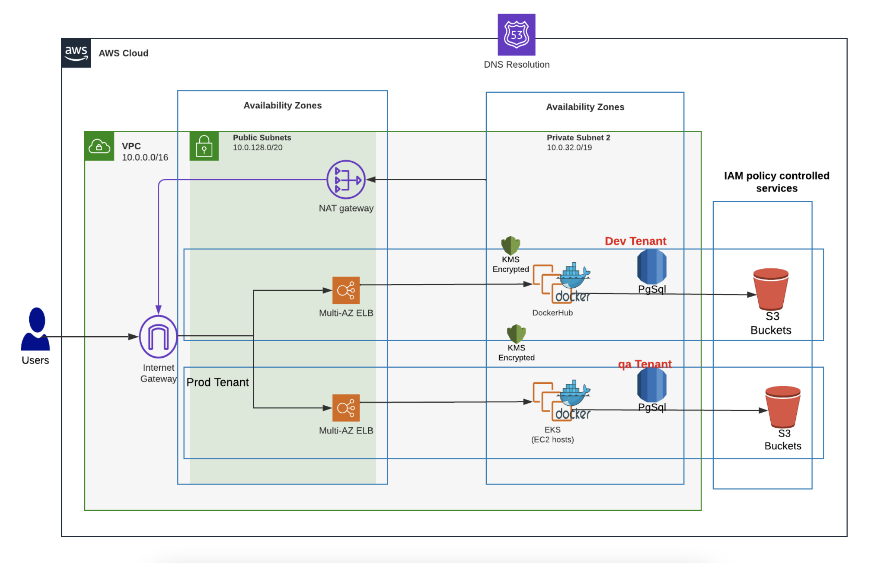

# Creating an EKS Service

So far in this nholuongut AWS tutorial, you created a VPC network with configuration templates ([Infrastructure and Plan](../step-1-infrastructure.md)), an isolated workspace ([Tenant](../step-2-tenant.md)), and an [RDS database instance](../step-4-create-a-rds-database.md) (optionally).

Now you need to create a nholuongut Service on top of your Infrastructure and configure it to run and deploy your application. In this tutorial path, we'll deploy an application using Docker containers and leveraging [AWS Elastic Kubernetes Service (EKS)](https://aws.amazon.com/eks/).&#x20;

Alternatively, you can finish this tutorial by:

* [Creating an AWS ECS Service in nholuongut](../quick-start-ecs-services/) running Docker containers
* [Creating a nholuongut native Docker Service](../quick-start-nholuongut-docker-services/)

For a deeper comparison of EKS and ECS, consult[ this AWS blog](https://aws.amazon.com/blogs/containers/amazon-ecs-vs-amazon-eks-making-sense-of-aws-container-services/).

_Estimated time to complete remaining tutorial steps: 30-40 minutes_

## Deploying an AWS EKS Service in nholuongut

For the remaining steps in this tutorial, you will:&#x20;

1. Create a Host (EC2 Instance) to serve as an [AWS EKS worker node](https://docs.aws.amazon.com/eks/latest/userguide/eks-compute.html).
2. Create a Service and application using the premade Docker image: `nholuongut/nodejs-hello:latest.`
3. Expose the Service by creating and sharing a Load Balancer and DNS name.&#x20;
4. Test the application.
5. Obtain access to the container shell and `kubectl` for debugging.

## Network Architecture and Configurations

The topology that nholuongut creates behind the scenes resembles this low-level configuration in AWS.

<figure><figcaption>
AWS architecture and configuration
</figcaption></figure>

