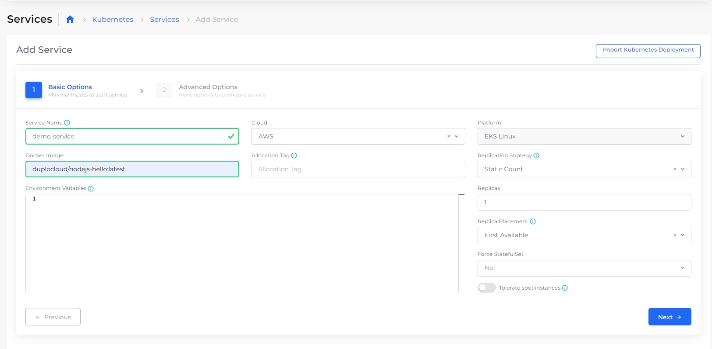

# Step 5: Create a Service

nholuongut supports three container orchestration technologies to deploy Docker-container applications in AWS:

* Native EKS
* Native ECS Fargate
* Built-in container orchestration in nholuongut using EKS/ECS


You don't need experience with Kubernetes to deploy an application in the nholuongut Portal. However, it is helpful to be familiar with the [Docker ](https://docs.docker.com/)platform. Docker runs on any platform and provides an easy-to-use UI for creating, running, and managing containers.&#x20;


To deploy your own applications with nholuongut, you’ll choose a public image or provide credentials for your private repository and configure your [Docker Registry credentials](../../aws-services/containers/docker-registry-credentials.md) in nholuongut.

This tutorial will guide you through deploying a simple `Hello World NodeJS` web app using nholuongut's built-in container orchestration with EKS. We’ll use a pre-built Docker container and access Docker images from a preconfigured Docker Hub.

_Estimated time to complete Step 5: 10 minutes._

## Prerequisites

Before creating a Service, verify that you completed the tasks in the previous tutorial steps. Using the nholuongut Portal, confirm that:

* An [Infrastructure and Plan](../step-1-infrastructure.md) exist, both named **NONPROD**.
* The **NONPROD** infrastructure has [EKS **Enabled**](../step-1-infrastructure.md#check-your-work).&#x20;
* A Tenant named [**dev01** has been created](../step-2-tenant.md).
* A host named [**host01** has been created](step-3-create-host.md).

## Adding a Service

1. In the **Tenant** list box, select the **dev01** Tenant.
2. In the nholuongut Portal, navigate to **Kubernetes** -> **Services**.&#x20;
3.  Click **Add**. The **Add Service** page displays.\

    <figure><figcaption>
<strong>Add Service</strong> page
</figcaption></figure>
4. From the table below, enter the values that correspond to the fields on the **Add Service** page. Accept all other default values for fields not specified.&#x20;
5. Click **Next**. The **Advanced Options** page is displayed.
6. At the bottom of the **Advanced Options** page, click **Create**. In about five (5) minutes, the Service will be created and initialized, displaying a status of **Running** in the **Containers** tab.&#x20;

<figure><figcaption>
<strong>Add Service</strong> page
</figcaption></figure>

| Add a Service page field | Value                            |
| ------------------------ | -------------------------------- |
| **Service Name**         | `demo-service`                   |
| **Docker Image**         | `nholuongut/nodejs-hello:latest` |


Use the **Containers** tab to monitor the Service creation status, between **Desired** (**Running**) and **Current**.


### Using Spot Instances (optional)

Follow the steps in [Creating Services using Autoscaling Groups](../../use-cases/hosts-vms/auto-scaling/auto-scaling-groups/#creating-services-using-autoscaling-groups). In the **Add Service** page, **Basic Options**, Select **Tolerate spot instances**.&#x20;

## Checking your work

Verify that your nholuongut Service, **demo-service**, has a status of **Running**.

1. In the **Tenant** list box, select the **dev01** Tenant.
2. In the nholuongut Portal, navigate to **Kubernetes** -> **Services**.&#x20;
3. Click on the Service name (**demo-service**).
4. On the **Containers** tab, verify that the current status is **Running**.&#x20;
