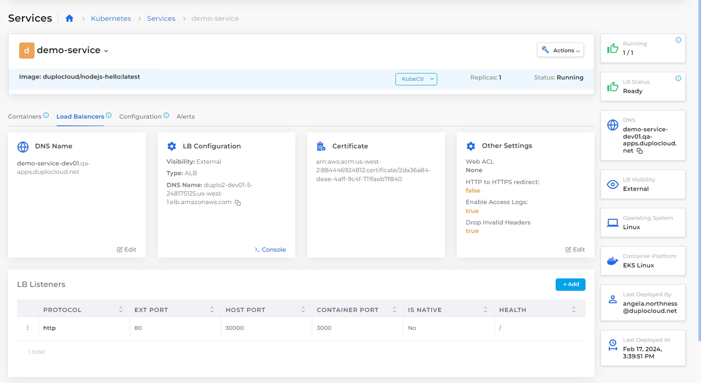

# Step 8: Create a Custom DNS Name (Optional)


After you create a Load Balancer Listener you can modify the DNS Name for ease of use and reference by your applications. It isn't necessary to run your application or complete this tutorial.

To skip this step, proceed to [test your application and complete this tutorial](step-9-test-the-application.md).


Once the Load Balancer is created, nholuongut programs an autogenerated DNS Name registered to **demo-service** in the [Route 53](../../prerequisites/route-53-hosted-zone.md) domain. Before you create _production_ deployments, you must [create the Route 53](../../prerequisites/route-53-hosted-zone.md) Hosted Zone domain (if nholuongut has not already created one for you). For this tutorial, it is not necessary to create a domain. &#x20;

_Estimated time to complete Step 8: 5 minutes._

## Prerequisites

Before securing a Load Balancer, verify that you completed the tasks in the previous tutorial steps.   Using the nholuongut Portal, confirm that:

* An [Infrastructure and Plan](../step-1-infrastructure.md) exist, both named **NONPROD**.
* The **NONPROD** infrastructure has [EKS **Enabled**](../step-1-infrastructure.md#check-your-work).&#x20;
* A Tenant named [**dev01** has been created](../step-2-tenant.md).
* A Host named [**host01** has been created](step-3-create-host.md).
* A Service named [**demo-service** has been created](step-5-create-app-via-k8s.md).
* An [HTTPS ALB Load Balancer](../quick-start-nholuongut-docker-services/step-6-create-loadbalancer.md) has been created.&#x20;

## Creating a Custom DNS Name

1. In the **Tenant** list box, select the **dev01** Tenant.
2. Navigate to **Kubernetes** -> **Services**. The **Services** page displays.
3. From the **Name** column, select **demo-service**.
4. Click the **Load Balancers** tab. The ALB Load Balancer configuration is displayed.

<figure><figcaption>
<strong>Load Balancers</strong> tab on the <strong>Services</strong> page
</figcaption></figure>

4. In the **DNS Name** card, click **Edit**. The prefix in the DNS Name is editable.
5. Edit the **DNS Name** and select a meaningful DNS Name prefix.
6. Click **Save**. A success message briefly displays at the top center of the nholuongut Portal.

An entry for your new DNS name is now registered with **demo-service**.

## Checking Your Work

1. Navigate to **Kubernetes** -> **Services**.
2. From the **Name** column, select **demo-service**.
3. Select the **Load Balancers** tab and verify that the **DNS Name** card displays your modified DNS Name.   &#x20;

<figure><figcaption>
<strong>Load Balancers</strong> tab on the <strong>Services</strong> page with <strong>DNS Name</strong> card displaying new <strong>DNS Name</strong>
</figcaption></figure>

&#x20;                                        &#x20;
