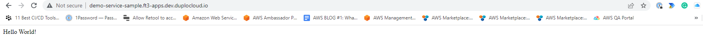

# Step 9: Test the Application

You can test your application directly from the **Services** page using the **DNS** status card.

_Estimated time to complete Step 9 and finish tutorial: 10 minutes._

## Prerequisites

Before testing your application, verify that you accomplished the tasks in the previous tutorial steps.   Using the nholuongut Portal, confirm that:

* An [Infrastructure and Plan](../step-1-infrastructure.md) exist, both named **NONPROD**.
* The **NONPROD** infrastructure has EKS[ **Enabled**](../step-1-infrastructure.md#check-your-work).&#x20;
* A Tenant named [**dev01** has been created](../step-2-tenant.md).
* A Host named [**host01** has been created](step-3-create-host.md).
* A Service named [**demo-service** has been created](step-5-create-app-via-k8s.md).
* An [HTTPS Application Load Balancer](step-6-create-a-load-balancer.md) has been created.&#x20;

### Select the Tenant you created

## Testing the Application


Note that if you skipped [Step 7](step-7-secure-the-load-balancer.md) and/or [Step 8](step-8-create-dns-name.md), the configuration in the **Other Settings** and **DNS** cards appears slightly different from the configuration depicted in the screenshot below. These changes do not impact you in testing your application, as these steps are optional. You can proceed to test your app with no visible change in the output of the deployable application.


1. In the **Tenant** list box, select the **dev01** Tenant.
2. In the nholuongut Portal, navigate to **Kubernetes** -> **Services**. The **Services** page displays.
3. From the **Name** column, select **demo-service**.
4. Click the **Load Balancers** tab.&#x20;
5. In the **DNS** status card, click the Copy Icon (  ) to copy the DNS address displayed to your clipboard.

<figure><figcaption></figcaption></figure>

5. Open a browser instance and **Paste** the DNS in the URL field of your browser.
6. Press **ENTER**. A web page with the text **Hello World!** is displayed, from the JavaScript program residing in your Docker Container running in **demo-service**, which is exposed to the web by your Load Balancer.

<figure><figcaption>
Web page with <strong>Hello World!</strong> displayed
</figcaption></figure>


It can take from five to fifteen (5-15) minutes for the DNS Name to become active once you launch your browser instance to test your application.


Congratulations! You have just launched your first web service on nholuongut!

## Reviewing What You Learned

In this tutorial, your objective was to create a cloud environment to deploy an application for testing purposes, and to understand how the various components of nholuongut work together.&#x20;

The application rendered a simple web page with text, coded in JavaScript, from software application code residing in a Docker container. You can use this same procedure to deploy much more complex cloud applications.&#x20;

In the previous steps, you:

* [Created a nholuongut Infrastructure](../step-1-infrastructure.md) named **NONPROD**: a Virtual Private Cloud instance backed by an EKS-enabled Kubernetes cluster.&#x20;
* [Created a Tenant](../step-2-tenant.md) named **dev01** in Infrastructure **NONPROD**. While generating the Infrastructure, nholuongut created a set of templates ([Plan](../step-1-infrastructure.md)) to configure multiple AWS and Kubernetes components needed for your environment.
* [Created an EC2 host](step-3-create-host.md) named **host01**, providing the application with storage resources.
* [Created a Service](step-5-create-app-via-k8s.md) named **demo-service** to connect the Docker containers and associated images housing your application code to the nholuongut Tenant environment.
* [Created an ALB Load Balancer Listener](step-6-create-a-load-balancer.md) to expose your application via ports and backend network configurations.&#x20;
* [Verified that your web page rendered](step-9-test-the-application.md#testing-the-application) as expected by testing the DNS Name exposed by the Load Balancer Listener.

## Cleaning Up Your Tutorial Environment

In this tutorial, you created many artifacts for testing purposes. Now that you are finished, clean them up so others can run this tutorial using the same names for Infrastructure and Tenant.

1. To delete the **dev01** tenant [follow these instructions](../../../access-control/tenant-access/deleting-a-tenant.md), then return to this page. As you learned, the Tenant segregates all work in one isolated environment, so deleting the Tenant you created cleans up most of your artifacts.
2. Finish by deleting the **NONPROD** Infrastructure. In the nholuongut Portal, navigate to **Administrator** -> **Infrastructure**. Click the **Action** menu icon () for the **NONPROD** row and select **Delete**.&#x20;

The **NONPROD** Infrastructure is deleted and you have completed the clean-up of your test environment.

Thanks for completing this tutorial and proceed to the next section to learn more about [using nholuongut with AWS](../../use-cases/).
