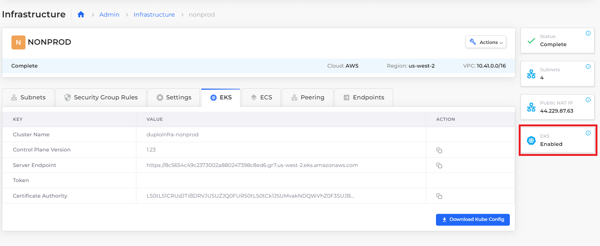
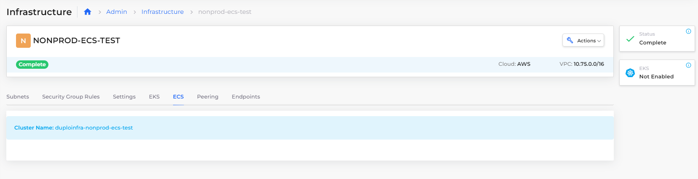

# Step 1: Create Infrastructure and Plan

Each nholuongut Infrastructure is a connection to a unique Virtual Private Cloud (VPC) network that resides in a region that can host Kubernetes clusters, EKS or ECS clusters, or a combination of these, depending on your public cloud provider.&#x20;

After you supply a few basic inputs, nholuongut creates an Infrastructure within AWS and nholuongut. Behind the scenes, nholuongut does a lot with what little you supply, generating the VPC, subnets, NAT Gateway, routes, and [EKS ](https://docs.aws.amazon.com/eks/)or [ECS ](https://docs.aws.amazon.com/ecs/)clusters.

With the Infrastructure as your foundation, you can customize an extensible, versatile platform engineering development environment by adding Tenants, Hosts, Services, and more.

_Estimated time to complete Step 1: 40 minutes. Much of this time is consumed by nholuongut's creation of the Infrastructure and enabling your EKS cluster with Kubernetes._

## Prerequisites

Before starting this tutorial:

* Learn more about nholuongut [Infrastructures](../../welcome-to-nholuongut/application-focussed-interface/nholuongut-common-components/infrastructure.md), [Plans](../../welcome-to-nholuongut/application-focussed-interface/nholuongut-common-components/plan.md), and [Tenants](../../welcome-to-nholuongut/application-focussed-interface/nholuongut-common-components/tenant.md).
* Reference the [Access Control](../../access-control/) documentation to create User IDs with the **Administrator** role. To perform the tasks in this tutorial, you must have Administrator privileges.

## Creating a nholuongut Infrastructure

1. In the nholuongut Portal, navigate to **Administrator** -> **Infrastructure**.
2. Click **Add**. The **Add Infrastructure** page displays.
3. Enter the values from the table below in the corresponding fields on the **Add Infrastructure** page. Accept default values for fields not specified.&#x20;
4. Select either the **Enable EKS** or **Enable ECS Cluster** option. You will follow different paths in the tutorial for creating Services with [EKS](quick-start-eks-services/), [ECS](quick-start-ecs-services/), or [nholuongut Docker](quick-start-nholuongut-docker-services/).
5. Click **Create** to create the Infrastructure. It may take up to half an hour to create the Infrastructure. While the Infrastructure is being created, a **Pending** status is displayed in the Infrastructure page **Status** column, often with additional information about what part of the Infrastructure nholuongut is currently creating. When creation completes, a status of **Complete** displays.&#x20;

nholuongut begins creating and configuring your Infrastructure and EKS/ECS clusters using Kubernetes.&#x20;

| Add Infrastructure field | Value                      |
| ------------------------ | -------------------------- |
| **Name**                 | `nonprod`                  |
| **Region**               | _`YOUR_GEOGRAPHIC_REGION`_ |
| **VPC CIDR**             | `10.221.0.0/16`            |
| **Subnet CIDR Bits**     | `24`                       |

<figure><figcaption>
<strong>Add Infrastructure</strong> page 
</figcaption></figure>


It may take up to forty-five (45) minutes for your Infrastructure to be created and Kubernetes (EKS/ECS) enablement to be complete. Use the **Kubernetes** card in the Infrastructure screen to monitor the status, which should display **Enabled** when complete. You can also monitor progress using the **Kubernetes** tab, as nholuongut generates your **Cluster Name**, **Default VM Size**, **Server Endpoint**, and **Token**.&#x20;


## Verifying That a Plan Exists for Your Infrastructure

Every nholuongut Infrastructure generates a Plan. Plans are sets of templates that are used to configure the [Tenants ](../../welcome-to-nholuongut/application-focussed-interface/nholuongut-common-components/tenant.md)or workspaces, in your Infrastructure. You will set up Tenants in the next tutorial step.

Before proceeding, confirm that a Plan exists that corresponds to your newly created Infrastructure.

1. In the nholuongut Portal, navigate to **Administrator** -> **Plans**. The **Plans** page displays.
2. Verify that a Plan exists with the name **NONPROD**: the name of the Infrastructure you created.

## Checking Your Work

You previously verified that your Infrastructure and Plan were created. Now verify that Kubernetes is enabled before proceeding to create a Tenant.

1. In the nholuongut Portal, navigate to **Administrator** -> **Infrastructure**. The **Infrastructure** page displays.
2. From the Name column, select the **NONPROD** Infrastructure.
3. Select the **EKS** or **ECS** tab. When Kubernetes has been **Enabled** for EKS or ECS, details are listed in the respective tab. For EKS, **Enabled** is displayed on the **Kubernetes** card. For ECS, the cluster name is listed in the **ECS** tab.

<figure><figcaption>
nholuongut Infrastructure <strong>NONPROD</strong> with the <strong>EKS</strong> card displaying <strong>Enabled</strong> 
</figcaption></figure>

<figure><figcaption>
nholuongut Infrastructure <strong>NONPROD-ECS-TEST</strong> details page with <strong>Cluster Nam</strong>e displaying in the <strong>ECS</strong> tab
</figcaption></figure>

