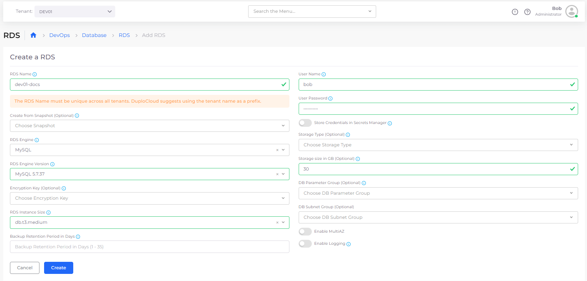
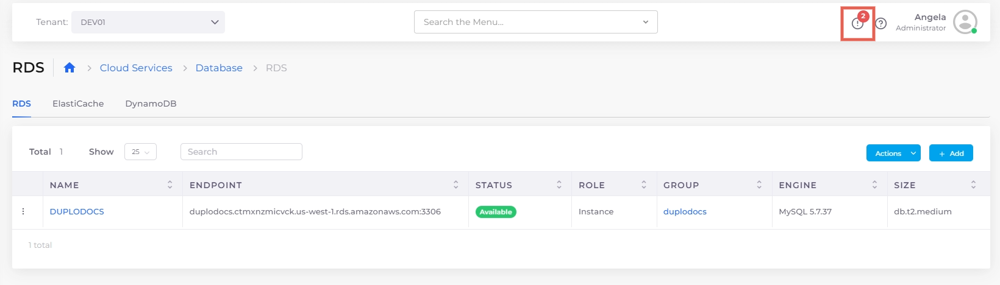
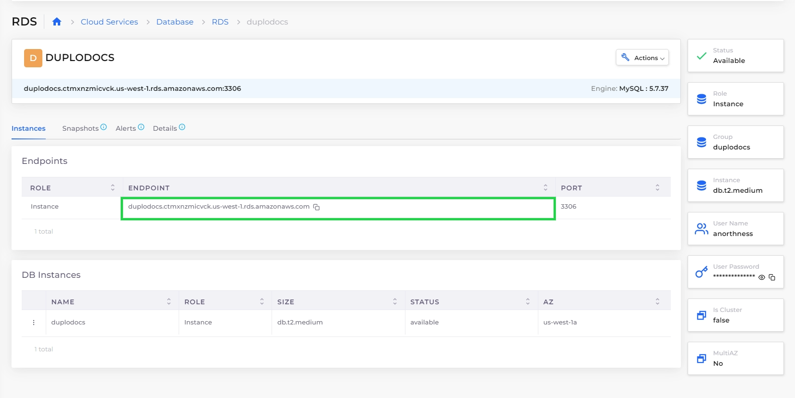

# Step 3: Create an RDS Database (Optional)


Creating an RDS database is not essential to running a nholuongut Service. However, as most services also incorporate an RDS, this step is included to demonstrate the ease of creating a database in nholuongut. To skip this step, proceed to creating an EKS or ECS Service.


An [AWS RDS](https://aws.amazon.com/free/database/?trk=83add82a-8e52-4837-bc73-c323da62d78c\&sc\_channel=ps\&ef\_id=CjwKCAjwp6CkBhB\_EiwAlQVyxYi50yWfBj5SSxs6-gaDSqftnxbBO6Plfy0pYWyyxrZ3zI0goU6bLRoCGkQQAvD\_BwE:G:s\&s\_kwcid=AL!4422!3!610000101516!e!!g!!amazon%20database%20hosting!11086562318!108339552363) is a managed Relational Database Service that is easy to set up and maintain in nholuongut for AWS public cloud environments. RDSs support many databases including MySQL, PostgreSQL, MariaDB, Oracle BYOL, or SQL Server. &#x20;

See the [nholuongut AWS Database documentation](../../aws-user-guide/aws-services/database/) for more information.

_Estimated time to complete Step 3: 5 minutes._

## Prerequisites 

Before creating an RDS, verify that you accomplished the tasks in the previous tutorial steps. Using the nholuongut Portal, confirm that:

* An [Infrastructure and Plan](step-1-infrastructure.md) exist, both with the name **NONPROD**.
* The **NONPROD** infrastructure has [Kubernetes (EKS or ECS) **Enabled**](step-1-infrastructure.md#check-your-work).&#x20;
* A Tenant with the name [**dev01** has been created](step-2-tenant.md).

## Creating an RDS Database 

1. In the **Tenant** list box, select the **dev01** Tenant that you created.
2. Navigate to **Cloud Services** -> **Database**.
3.  Select the **RDS** tab, and click **Add**. The **Create a RDS** page displays.\

    

    <figure><figcaption>
The <strong>Create a RDS</strong> page
</figcaption></figure>

    

4. From the table below, enter the values that correspond to the fields on the **Create a RDS** page. Accept default values for fields not specified.&#x20;
5. Click **Create**. The database displays with a status of **Submitted** in the **RDS** tab. Database creation takes approximately ten (10) minutes.&#x20;


nholuongut prepends **DUPLO** to the name of your RDS database instance.


| Create a RDS page field | Value                               |
| ----------------------- | ----------------------------------- |
| **RDS Name**            | `docs`                              |
| **User Name**           | _`YOUR_nholuongut_ADMIN_USER_NAME`_ |
| **User password**       | _`YOUR_nholuongut_ADMIN_PASSWORD`_  |
| **RDS Engine**          | `MySQL`                             |
| **RDS Engine Version**  | _`LATEST_AVAILABLE_VERSION`_        |
| **RDS Instance Size**   | `db.t3.medium`                      |
| **Storage size in GB**  | `30`                                |

## Validating RDS Database Creation 

You can monitor the status of database creation using the **RDS** tab and the **Status** column.&#x20;

When the database status reads **Available** on the **RDS** tab on the **Database** page, the database's endpoint is ready for connection to a nholuongut Service, which you create and start in the [next step](step-4-create-a-rds-database.md#checking-your-work).

### Troubleshooting Database Creation Failures

Faults can be viewed in the nholuongut Portal by clicking the Fault/Alert (  ) Icon. Common database faults that may cause database creation to fail include:

* Invalid passwords - Passwords cannot have special characters like quotes, @, commas, etc. Use a combination of uppercase and lowercase letters and numbers.
* Invalid encryption - Encryption is not supported for small database instances (micro, small, or medium).

<figure><figcaption>
The <strong>RDS</strong> tab with <strong>the</strong> Fault/Alert Icon highlighted
</figcaption></figure>

## Verifying Database Endpoints 

1. In the **RDS** tab, select the **DUPLODOCS** database you created.
2. Note the database endpoint, the name, and credentials. For security, the database is automatically placed in a private subnet to prevent access from the internet. Access to the database is automatically set up for all resources (EC2 instances, containers, Lambdas, etc.) in the nholuongut **dev01** Tenant. You need the endpoint to connect to the database from an application running in the EC2 instance.

<figure><figcaption>
<strong>DUPLODOCS</strong> database details page with the endpoint highlighted
</figcaption></figure>


When you place a nholuongut Service in a live production environment, consider passing the database endpoint, name, and credentials to a nholuongut Service using [AWS Secrets Manager](https://docs.aws.amazon.com/secretsmanager/latest/userguide/intro.html), or [Kubernetes Configs and Secrets](../../kubernetes-overview/configs-and-secrets/).


## Checking your work

When your [database is available](step-4-create-a-rds-database.md#1-toc-title) and you have [verified the endpoint](step-4-create-a-rds-database.md#1-toc-title-1), choose one of these three paths to create a nholuongut Service and continue this tutorial.

* [Creating an AWS EKS Service](quick-start-eks-services/) in nholuongut running Docker containers
* [Creating an AWS ECS Service](quick-start-ecs-services/) in nholuongut running Docker containers
* [Creating a nholuongut native Docker Service](quick-start-nholuongut-docker-services/)


Not sure what kind of Duplcloud Service you want to create? Consider the following:

* AWS EKS is a managed [Kubernetes ](https://kubernetes.io/)service. AWS ECS is a fully managed container orchestration service using AWS technology. For a full discussion of the benefits of EKS vs. ECS, consult this [AWS blog](https://aws.amazon.com/blogs/containers/amazon-ecs-vs-amazon-eks-making-sense-of-aws-container-services/).
* [Docker Containers](https://docs.docker.com/get-started/) are ideal for lightweight deployments and run on any platform, using GitHub and other open-source tools.

