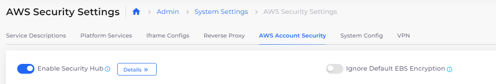

# AWS Account Security settings

### Configuring Account Security Settings

To configure AWS Account Security settings, navigate to **Administrator** -> **System Settings** in the nholuongut Portal and click the **AWS Account Security** tab.

Enable the settings listed in the table below by clicking the setting switch.

<figure><figcaption>
<strong>AWS Security Settings</strong> page with <strong>Enable Security Hub</strong> setting switch enabled.
</figcaption></figure>

| Settings Name                             | Description                                                                                                                                                                                                                                                                                                                                                                                                                                                                                                                                                                                                                                                                                                                                  |
| ----------------------------------------- | -------------------------------------------------------------------------------------------------------------------------------------------------------------------------------------------------------------------------------------------------------------------------------------------------------------------------------------------------------------------------------------------------------------------------------------------------------------------------------------------------------------------------------------------------------------------------------------------------------------------------------------------------------------------------------------------------------------------------------------------- |
| **Enable Security Hub**                   | Enables AWS Security Hub in all AWS regions managed by nholuongut                                                                                                                                                                                                                                                                                                                                                                                                                                                                                                                                                                                                                                                                            |
| **Enable Guard Duty**                     | Enables AWS Guard Duty in all AWS regions managed by nholuongut                                                                                                                                                                                                                                                                                                                                                                                                                                                                                                                                                                                                                                                                              |
| **Enable IAM Password Policy**            | 

Enables an account-level IAM User password policy, according to these password requirements:
<ul><li>Minimum password length is 14 characters</li><li>At least one uppercase letter from the Latin alphabet (<strong>A</strong>-<strong>Z</strong>)</li><li>At least one lowercase letter from the Latin alphabet (<strong>a</strong>-<strong>z</strong>)</li><li>At least one number (<strong>0</strong>-<strong>9</strong>)</li><li>At least one non-alphanumeric character (<strong>! @ # $ % ^ &#x26; * ( ) _ + - = [ ] { } | '</strong>)</li><li>Passwords expire in 90 days</li><li>Users may change their passwords</li><li>The last twenty-four (24) passwords are remembered by the system, to prevent reuse</li></ul> |
| **Enable CloudTrail**                     | 

Enables a multi-region CloudTrail for an AWS account. Enabling this feature:
<ul><li>Creates and manages a multi-region CloudTrail for the AWS account in nholuongut.</li><li>Creates a CloudWatch log group named <code>/cloudtrail/duplo</code> that receives CloudTrail events.</li><li>Creates and manages an S3 bucket that receives CloudTrail log files.</li></ul>                                                                                                                                                                                                                                                                                                                                                       |
| **Enable Inspector**                      | Enables AWS Inspector in any region where there is a public cloud infrastructure managed by nholuongut                                                                                                                                                                                                                                                                                                                                                                                                                                                                                                                                                                                                                                       |
| **Ignore Default EBS Encryption**         | 
By default, nholuongut enables EBS Default Encryption for all regions in which you deploy infrastructure. 

Enabling this setting allows nholuongut to override the EBS Default Encryption settings when creating new Infrastructures. Note that you can still edit the <code>EBS Encryption by Default</code> setting to enable EBS encryption by default for your Infrastructure, for the entire AWS region, if needed.
                                                                                                                                                                                                                                                                                                        |
| **Enable VPC Flow Logs**                  | Enables VPC flow logs for all VPCs created by nholuongut                                                                                                                                                                                                                                                                                                                                                                                                                                                                                                                                                                                                                                                                                     |
| **Delete Default NACL Rule(s)**           | Deletes default NACL rules for all VPCs created by nholuongut                                                                                                                                                                                                                                                                                                                                                                                                                                                                                                                                                                                                                                                                                |
| **Delete Default VPC(s)**                 | Deletes default VPCs in all AWS regions managed by nholuongut                                                                                                                                                                                                                                                                                                                                                                                                                                                                                                                                                                                                                                                                                |
| **Revoke Default Security Group Rule(s)** | Revokes default Security Group rules for all VPCs created by nholuongut                                                                                                                                                                                                                                                                                                                                                                                                                                                                                                                                                                                                                                                                      |
| **Globally Block Public Access to S3**    | Restricts Public access to S3 buckets                                                                                                                                                                                                                                                                                                                                                                                                                                                                                                                                                                                                                                                                                                        |
| **Configure SSL Policy to LBs**           | Contact a nholuongut Administrator to configure this setting at the AWS system level.                                                                                                                                                                                                                                                                                                                                                                                                                                                                                                                                                                                                                                                        |
