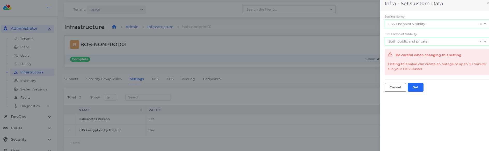

# Infrastructure Security settings

### Configuring Plan Settings

To configure Plan settings, navigate to **Administrator** -> **Plans** in the nholuongut Portal. Select the name of the Plan that matches the nholuongut Infrastructure for which you want to configure settings. Click the **Capabilities** tab to view Plan Settings.

Click the Edit icon (  ) to open the **Update Capabilities** pane. Enable the settings listed in the table below by clicking the setting switch and clicking **Submit**.

<figure><figcaption>
Plan Capabilities tab with Edit Icon highlighted
</figcaption></figure>

A Default Value of **Enabled** in the table below displays a property **Value** of **True** in the UI.

A Default Value of **Disabled** in the table below displays a property **Value** of **False** in the UI.

| Plan Settings                           | Description                                                                                                                                                                                                                                                                                                                                                                                                                                                                                                | Default Value |
| --------------------------------------- | ---------------------------------------------------------------------------------------------------------------------------------------------------------------------------------------------------------------------------------------------------------------------------------------------------------------------------------------------------------------------------------------------------------------------------------------------------------------------------------------------------------- | ------------- |
| **Unrestricted External Load Balancer** | 
 Creation of an internet-facing load balancer with non-default listener ports (other than <strong>80</strong> and <strong>443</strong>) will be automatically allowed to everyone (<strong>0.0.0.0/0</strong>) if this setting is enabled. If this detting is disabled, you must  manually add a Security Group <a href="../../kubernetes-overview/ingress-loadbalancer/adding-ingress.md#add-rules-to-kubernetes-ingress-and-complete-ingress-setup">Ingress rule</a> to access the service 
 | Enabled       |

***

### Configuring Infrastructure Settings

To configure Infrastructure settings, navigate to **Administrator** -> **Infrastructure** in the nholuongut Portal. Select the name of the Infrastructure for which you want to configure the settings. Click the **Settings** tab to view Infrastructure settings.

To update or remove an existing setting, click the () icon to the left of the setting **Name** and select **Update Setting** or **Remove Setting**. To add any of these settings, click **Add.** Select and **Enable** the settings using the **Infra- Set Custom Data** pane.

<figure><figcaption>
<strong>Infra - Set Custom Data</strong> pane for Infrastructure settings
</figcaption></figure>

A Default Value of **Enabled** in the table below displays a property value of **True** in the UI.

A Default Value of **Disabled** in the table below displays a property value of **False** in the UI.

| Infrastructure Settings     | Description                                                                                                                                                                                                                                      | Default Value |
| --------------------------- | ------------------------------------------------------------------------------------------------------------------------------------------------------------------------------------------------------------------------------------------------ | ------------- |
| **EKS Endpoint Visibility** | 
 Set as <strong>Private</strong> to access an EKS Cluster using a private endpoint with <a href="../use-cases/creating-an-infrastructure-and-plan-for-aws/kubernetes-cluster/enable-eks-endpoints.md">nholuongut VPN enabled</a>.  
 | **Public**    |
|                             |                                                                                                                                                                                                                                                  |               |

