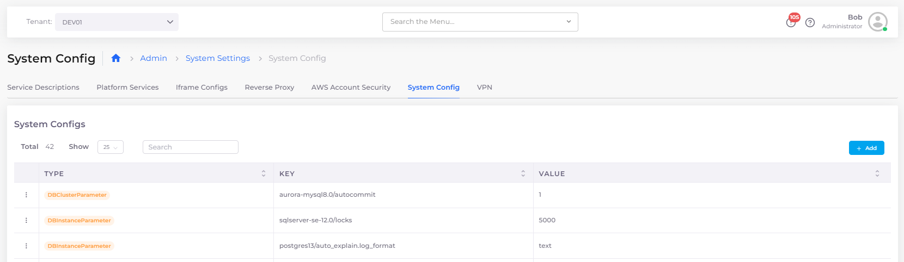

# System Security settings

### Configuring global System Security settings

To configure global System Security settings for the nholuongut Portal, navigate to **Administrator** -> **System Settings** in the nholuongut Portal and click the **System Config** tab.

<figure><figcaption>
<strong>System Config</strong> tab for <strong>System Settings</strong>
</figcaption></figure>

To update or remove an existing setting, click the icon to the left of the **Config Type** and select **Update** or **Delete**. To add any of these settings, click **Add.** Using the Add Config pane, select the **Config Type** and **Key** from the table below and enter the appropriate **Value**.

<table><thead><tr><th width="358">System Config Setting  (Key)</th><th>Description</th><th>Config Type</th><th data-hidden>Description</th><th data-hidden>Config Type</th><th data-hidden>Value</th></tr></thead><tbody><tr><td><strong>Disable SSH Key Download</strong> </td><td>Setting <strong>Value</strong> to <strong>True</strong> prevents a user from downloading an SSH key</td><td><strong>Flags</strong></td><td>Setting to Falsey</td><td><strong>Flags</strong></td><td><strong>False</strong></td></tr><tr><td><strong>Disable Host Creation with Custom AMI</strong> </td><td>Default is <strong>False</strong>, allowing host creation with a custom AMI unless you set <strong>Value</strong> to <strong>True</strong>.</td><td><strong>Flags</strong></td><td>Default: Allowed  Enable to restrict using Custom AMI for EC2 creation</td><td><strong>Flags</strong></td><td></td></tr><tr><td><strong>Duplo Managed Tag Keys</strong></td><td>Allows you to configure <a href="../use-cases/custom-resource-tags.md">Custom Tags</a> for AWS resources that you create from the nholuongut Portal.</td><td><strong>App Config</strong></td><td>Allows to configure Custom Tags for the AWS resources created from portal</td><td><strong>AppConfig</strong></td><td></td></tr><tr><td><strong>Block Master VPC CIDR Allow in EKS SG</strong></td><td>Setting <strong>Value</strong> to <strong>True</strong> prevents a user from adding nholuongut Master VPC CiDR to an EKS Security Group definition.</td><td><strong>Flags</strong></td><td>Setting  this Flag, resticts adding Duplo master VPC CIDR to EKS Security Group</td><td><strong>Flags</strong></td><td></td></tr></tbody></table>
