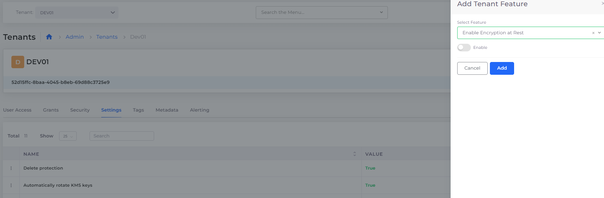

# Tenant Security settings

### Configuring Security settings at the Tenant Level

Configure these settings (properties) by navigating to **Administrator** -> **Tenants** in the nholuongut Portal. Select the Tenant for which you want to configure the settings listed below and click the **Settings** tab. The Tenant Feature Properties are listed in the **Name** column in the **Settings** tab.

To edit or remove an existing property, click the icon to the left of the property **Name** and select **Edit Setting** or **Remove Setting**. To add any of these settings, click **Add.** Select and **Enable** the feature using the **Add Tenant Feature** pane.

<figure><figcaption>
<strong>Add Tenant Feature</strong> pane for configuring Tenant settings
</figcaption></figure>

A Default Value of **Enabled** in the table below displays a property value of **True** in the UI.

A Default Value of **Disabled** in the table below displays a property value of **False** in the UI.

<table><thead><tr><th>Tenant Feature Property </th><th>Description</th><th>Default Value</th><th data-hidden>Name</th></tr></thead><tbody><tr><td><strong>Enable Encryption at Rest</strong></td><td>Configure encryption at rest for AWS resources such as RDS, ElastiCache, ElasticSearch</td><td>Disabled</td><td></td></tr><tr><td><strong>Block Public Access</strong></td><td>Blocks (disables) public access to S3Default</td><td>Enabled</td><td></td></tr><tr><td><strong>Maximum Session Duration</strong></td><td>
 Configure AWS IAM Role Maximum session duration for the tenant role

Provide input in Hours.  Additional details can be found <a href="../use-cases/tenant-environment/tenant-session-duration.md">here</a>
</td><td><strong>3600</strong> seconds (1 Hour) </td><td></td></tr><tr><td><strong>Enforce SSL for ES</strong></td><td>Require SSL encryption for AWS Elasticsearch</td><td>Enabled</td><td></td></tr><tr><td><strong>Enforce SSL for S3</strong></td><td>Require SSL encryption for AWS S3 Buckets</td><td>Enabled</td><td></td></tr><tr><td><strong>Enable node to node encryption for ES</strong></td><td>Enables Node-to-node encryption to protects data transferred between nodes using SSL encryption </td><td>Enabled</td><td></td></tr><tr><td><strong>Automatically rotate KMS keys</strong></td><td>Enables automatic rotation of KMS keys to prevent extensive key reuse</td><td>Enabled</td><td></td></tr><tr><td><strong>Delete protection</strong></td><td>Protects Tenants from accidental deletion. See <a href="../../access-control/tenant-access/deleting-a-tenant.md">Deleting a Tenant</a></td><td>Enabled</td><td></td></tr><tr><td><strong>AWS Access Token Validity</strong></td><td>

AWS Console JIT (Just-In-Time)  session token validation time in seconds before time-out
</td><td><strong>3600</strong> seconds (1 Hour) </td><td></td></tr><tr><td><strong>Restrict Pubic IP  for Non-Admin</strong></td><td> Restricts Non-Administrators from creating a load balancer that uses a Public IP address</td><td>Disabled</td><td></td></tr><tr><td><strong>Restrict EC2 instance create in public subnet for non-admin</strong></td><td> Restricts Non-Administrators  from creating EC2 Instances that use a Public IP address</td><td>Disabled</td><td></td></tr><tr><td><strong>Restrict non-ssl listener create for non-admin</strong></td><td> Restricts Non-Administrators  from creating a load balancer without SSL certificates</td><td>Disabled</td><td></td></tr></tbody></table>

