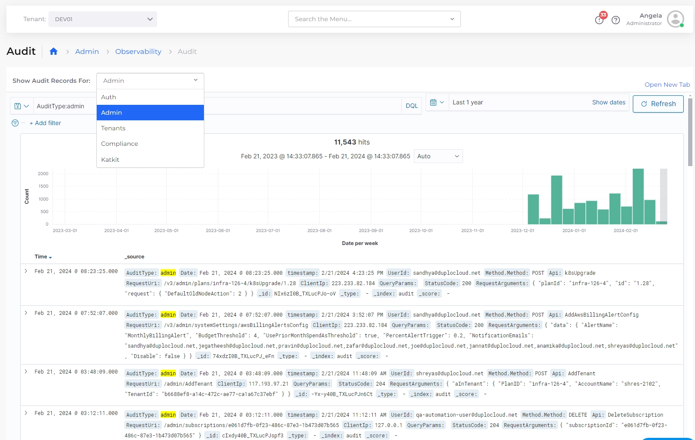
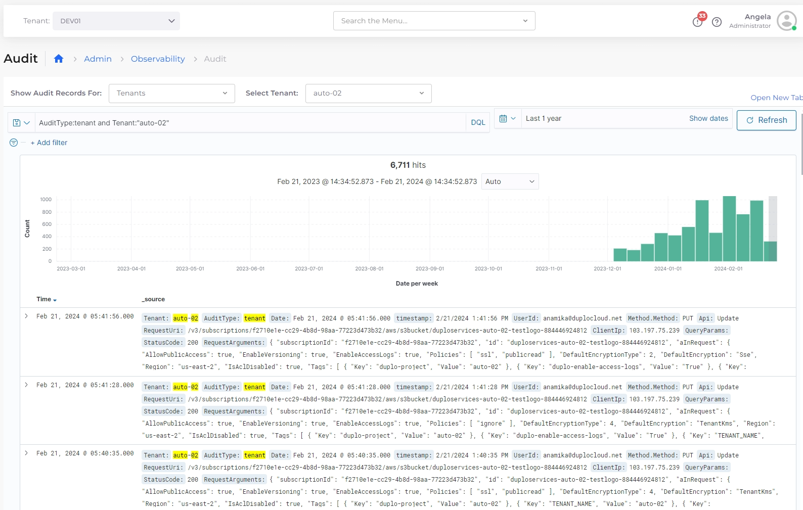
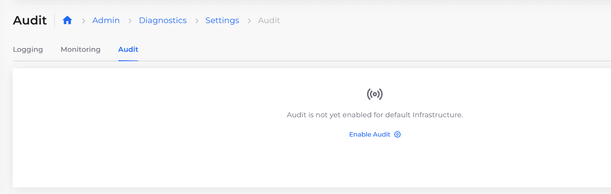
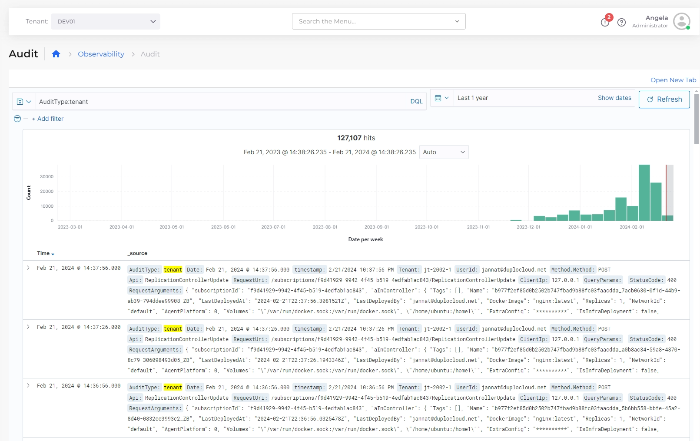

# Auditing

The nholuongut Portal provides a comprehensive audit trail, including reports and logs, for security and compliance purposes. Using the **Show Audit Records for** list box, you can display real-time audit data for:

* **Auth** (Authentications)
* **Admin** (Administrators)
* **Tenants** (nholuongut Tenants)
* **Compliance** (such as HIPAA, SOC 2, and HIGHTRUST, among others)
* [**Kat-Kit**](../../introduction-to-ci-cd/katkit/) (nholuongut's CI/CD Tool)

<figure><figcaption><p>The <strong>Audit</strong> page with <strong>Admin</strong> audit records selected using the <strong>Show Audit Records</strong> for list box</p></figcaption></figure>


<figure><figcaption><p>The <strong>Audit</strong> page with audit records selected for the <strong>DEV01</strong> Tenant</p></figcaption></figure>

## Enabling Audit

1. In the nholuongut Portal, navigate to **Administrator** -> **Observability** -> **Settings,** and select the **Audit** tab. The **Audit** page displays.
2. Click the **Enable Audit** link.&#x20;

<figure><figcaption><p><strong>Enable Audit</strong> link on the <strong>Audit</strong> page</p></figcaption></figure>

## Viewing detailed auditing diagnostics

To view complete auditing reports and logs, navigate to the **Observability** -> **Audit** page in the nholuongut Portal.

<figure><figcaption><p><strong>Audit</strong> page in the nholuongut Portal</p></figcaption></figure>

## Configuring a custom S3 bucket for auditing in another AWS account

You can create an S3 bucket for auditing in another account, other than the nholuongut Master Account.&#x20;

### Prerequisites

1. Verify that the S3 bucket exists in another account, and note the bucket name. In this example, we assume a BUCKET\_REGION of **us-west-2** and a BUCKET name of **audit-s2-bucket-another-account**.
2. Ensure that your S3 bucket has `Duplo Master` permission to access the `S3:PutObject`. Refer to the code snippet below for an example.

```
{
  "Version": "2012-10-17",
  "Statement": [
  {
            "Effect": "Allow",
            "Principal": {
                "AWS": "arn:aws:iam::accountid:role/duplomaster"
            },
            "Action": "S3:PutObject",
            "Resource": [
                "arn:aws:s3:::arn:aws:s3:::bucknetname/*",
                "arn:aws:s3:::arn:aws:s3:::bucketname"
            ]
        }
  ]
}
```

### Configuring S3 bucket region and bucket name

1. In the nholuongut Portal, navigate to **Administrator** -> **System Settings**.
2. Click the **System Config** tab.

#### Configuring the S3 Bucket Region

Continuing the example above, configure the **S3BUCKET\_REGION**.

1. Click **Add**. The **Add Config** pane displays.
2. From the **Config Type** list box, select **AppConfig**.
3. in the **Key** list box, enter **DUPLO\_AUDIT\_S3BUCKET\_REGION**.
4. In the **Value** field, enter **us-west-2**.
5. Click **Submit**.

#### Configuring Bucket Name

Continuing the example above, configure the **S3BUCKET** name.

1. Click **Add**. The **Add Config** pane displays.
2. From the **Config Type** list box, select **AppConfig**.
3. in the **Key** list box, enter **DUPLO\_AUDIT\_S3BUCKET**.
4. In the **Value** field, enter **audit-s2-bucket-another-account**.
5. Click **Submit**.

Your S3 bucket region and name configurations are displayed in the **System Config** tab. [View details on the Audit page](auditing.md#viewing-detailed-auditing-diagnostics) in the nholuongut Portal.

<figure><figcaption><p><strong>System Config</strong> tab with <strong>AppConfig</strong>s for S3 bucket region and name</p></figcaption></figure>


Contact your nholuongut Support team if you have additional questions or issues.

