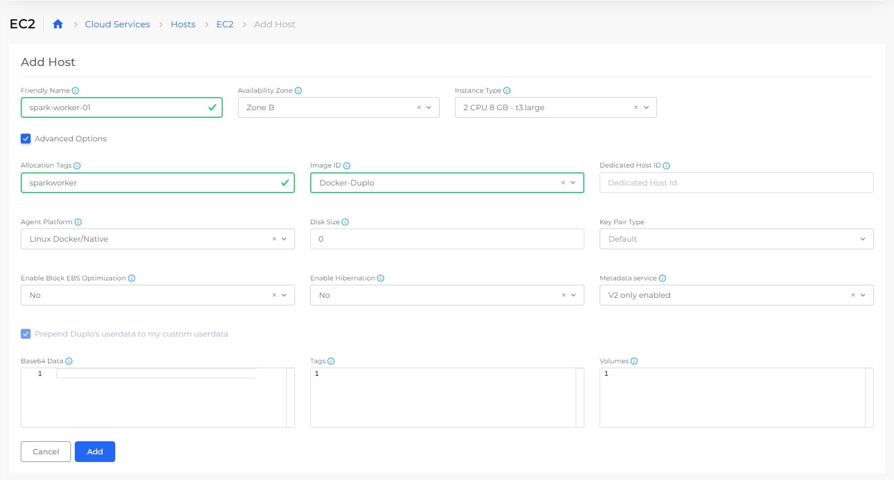
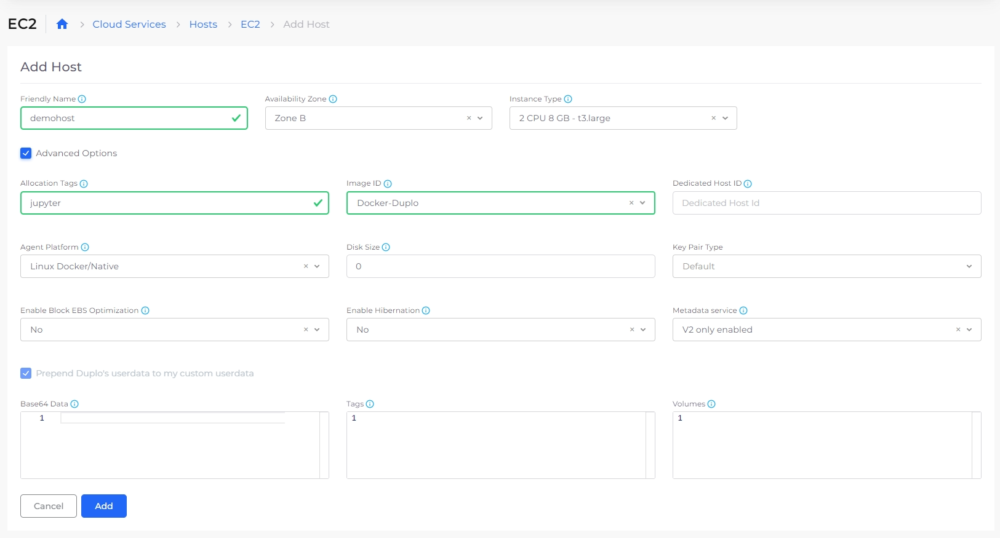

# Big Data and ETL

## Introduction <a href="#id-0-toc-title" id="id-0-toc-title"></a>

* **Use case:**
  * **Collection of data from using various methods/sources**
    * Web scraping: Selenium using headless chrome/firefox.
    * Web crawling: status website sing crawling
    * API to Data collection: It could be REST or GraphQL API
    * Private internal customer data collected over various transactions
    * Private external customer data collected over secured SFTP
    * The data purchased from 3rd party
    * The data from various social networks
  * **Correlate data from various sources**
    * Clean up and Process data and apply various statistical methods, create
    * Correlate terabytes of data from various sources and make sense from the data.
    * Detect anomalies, summarize, bucketize, and various aggregations
    * Attach meta-data to enrich data.
    * Create data for NLP and ML models for predictions of future events.
  * **AI/ML pipelines and life-cycle management**
    * Make data available to data science team
    * Train models and do continuous improvement trials, reinforcement learning.
    * Create anomalies, bucketize data, summarize and do various aggregations.
    * Train NLP and ML models for predictions of future events based on history
    * Create history for models/hyper parameters and data at various stages.
* **Deploying Apache Spark™ cluster**

## Creating a Spark cluster with a Jupyter notebook <a href="#id-1-toc-title" id="id-1-toc-title"></a>

In this tutorial we will create a Spark cluster with a Jupyter notebook. A typical use case is ETL jobs, for example reading parquet files from S3, processing and pushing reports to databases. The aim is to process GBs of data in faster and cost-effective way.

The high-level steps are:

1. Create 3 VMs one for each Spark master, Spark worker and Jupyter notebook.
2. Deploy Docker images for each of these on these VMs.

### **Create a host for Spark master**

From the nholuongut portal, navigate to **Cloud Services -> Hosts -> EC2.** Click **+Add** and check the **Advanced Options** box. Change the value of instance type to ‘`m4.xlarge`‘ and add an allocation tag ‘`sparkmaster`‘.

<figure><figcaption><p>The <strong>EC2 Add Host</strong> page</p></figcaption></figure>

### **Create a host for Spark worker**

Create another host for the worker. Change the value of instance type to ‘`m4.4xlarge`‘ and add an allocation tag ‘`sparkworker`‘. Click Submit. The number of workers depends on how much load you want to process. You should add one host for each worker. They should all have the same allocation tag ‘`sparkworker`‘. You can add and remove workers and scale up or down the Spark worker service as many times as you want. We will see in the following steps.

<figure><figcaption><p>The <strong>EC2 Add Host</strong> page</p></figcaption></figure>

### **Create a host for Jupyter**

Create one more host for Jupyter notebook. Choose the value of instance type to ‘`m4.4xlarge`‘ and add the allocation tag as ‘`jupyter`‘.

<figure><figcaption><p>The <strong>EC2 Add Host</strong> page</p></figcaption></figure>

### **Create a Spark master Docker service**

Navigate to **Docker** -> **Services** and click **Add.** In the **Service** **Name** field, enter ‘`sparkmaster`‘ and in the Docker Image field, enter ‘`nholuongut/anyservice:spark_v6'`, add the allocation tag ‘`sparkmaster`‘. From the **Docker Networks** list box, select **Host Network**. By setting this in Docker Host config you are making the container networking the same as the VM i.e., container IP is same as VM.


### **Create a Jupyter service**

First we need the IP address of Spark master. Click on Spark master service and on the right expand the container details and copy the host IP. Create another service, under name choose ‘`jupyter`‘, image ‘`nholuongut/anyservice:spark_notebook_pyspark_scala_v4`‘, add the allocation jupyter and select Host network for Docker Host Config, Add volume mapping “`/home/ubuntu/jupyter:/home/jovyan/work`“, Also provide the environment variables

```
{"SPARK_OPTS":" --master spark://<>:7077 --driver-memory 20g --executor-memory 15g --executor-cores 4 "}
```

Replace the brackets `<>` with the IP you just got. See figure 5.


### **Create Spark workers**

Create another service named ‘`sparkworker1`\`, image ‘`nholuongut/anyservice:spark_v7`‘, add the allocation tag ‘`sparkworker`‘ and select **Host Network** for **Docker Networ**k. Also provide the environment variables

`{"node": "worker", "masterip": "<>"}`

Replace the brackets `<>` with the IP you just got. See Figure 5.

Depending on how many worker hosts you have created, use the same number under replicas and that is the way you can scale up and down. At any time, you can add new hosts, set the allocation tag ‘`sparkworker`‘ and then under services, edit the sparkworker service and update the replicas.


### **Create a Docker services shell**

Add or update shell access by clicking on `>_` icon. This gives you easy access into the container shell. You will need to wait for 5 minutes for the shell to be ready. Make sure you are connected to VPN if you choose to launch the shell as internal only

### **Open Jupyter Docker shell**

Select Jupyter service and expand the container. Copy the hostip and then click on `>_` icon.


### **Get Jupyter URL**

Once you are inside the shell. Run command ‘`> jupyter notebook list`‘ to get the URL along with auth token. Replace the IP with Jupyter IP you copied previously. See Figure 5.


### **Open Jupyter**

In your browser, navigate to the Jupyter URL and you should be able to see the UI.


Now you can use Jupyter to connect to data sources and destinations and do ETL jobs. Sources and destinations can include various SQL and NoSQL databases, S3 and various reporting tools including big data and GPU-based Deep learning.

## Creating a Jupyter notebook with an ETL use-case <a href="#id-12-toc-title" id="id-12-toc-title"></a>

In this following we will create a Jupyter notebook and show some basic web scraping, using Spark for preprocessing, exporting into schema, do ETLs, join multiple dataframes (parquets), and export reports into MySQL.

### **Scrape data from internet**

Connect to a website and parse html (using jsoup)


### **Download data**

Extract the downloaded zip. This particular file is 8 GB in size and has 9 million records in csv


### **Save to S3**

Upload the data to AWS S3


### **Connect to Spark cluster**

Also Configure session with required settings to read and write from AWS S3


### **Load data**

Load data in Spark cluster


### **Schema**

Define the Spark schema


### **Process**

Do data processing


### **SQL select**

Setup Spark SQL


### **SQL Joins**

Spark SQL joins 20 GB of data from multiple sources


### **Export reports**

Export reports to RDS for UI consumption Generate various charts and graphs


