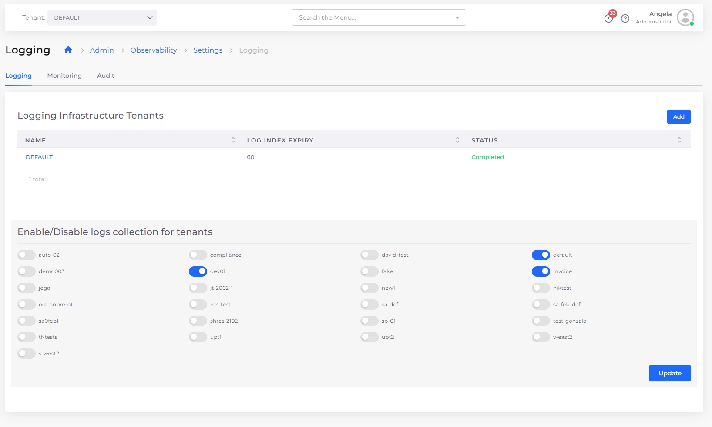

# Configure Logging per Tenant

Tailor your logging data to your specific needs by configuring log collection per Tenant.

## Prerequisites

* Before configuring logging for each Tenant, enable logging for the [Default Tenant](central-logging-setup.md) and enable logging for [non-Default Tenants](enable-non-default-tenant-logging.md), if needed.

## Configuring Log Collection Per Tenant


If a Tenant is not included in the **Enable/Disable logs collection for tenants** area, ensure that you have completed the listed prerequisites.&#x20;


1. From the nholuongut Portal, navigate to **Administrator** -> **Observability** -> **Basic** -> **Settings**, and select the **Logging** tab. &#x20;
2. In the **Enable/Disable logs collection for tenants** area, select the Tenants for which you want to enable log collection.&#x20;
3. Click **Update**. Elastic Filebeat Service begins log collection for the selected Tenants.&#x20;

<figure><figcaption>
The <strong>Logging</strong> tab on the <strong>Observability Settings</strong> page
</figcaption></figure>


When you enable logging for a Tenant, an Elastic Filebeat Service starts and begins log collection. The [Elastic Filebeat](https://www.elastic.co/guide/en/beats/filebeat/current/filebeat-overview.html) Service must be running for log collection to occur.&#x20;

To view the Filebeat Service, navigate to **Kubernetes** -> **Services.**&#x20;

