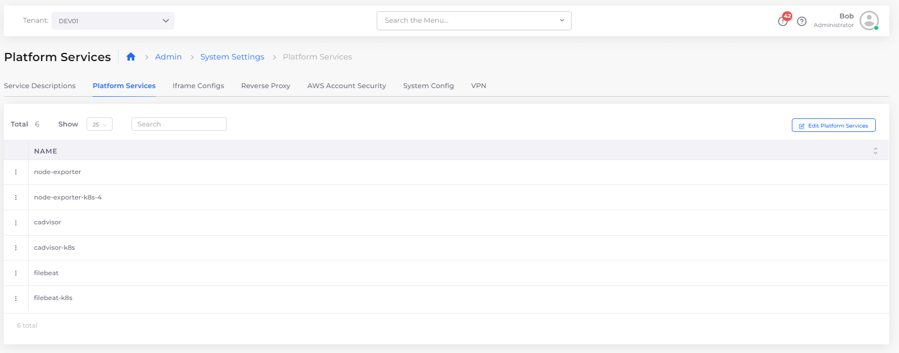

# Create custom logs

There are several use cases for customized log collection. The central logging stack is deployed within your environment, as with any other application, streamlining the customization process.

## **Customizing OpenSearch logging**&#x20;

The version of OpenSearch, the EC2 host size, and the control plane configuration are all deployed based on the configuration you define in the Service Description. Use this procedure to customize the Service Description according to your requirements.&#x20;


You must make Service Description changes before you [enable central logging](central-logging-setup.md). If central logging is enabled, you cannot edit the description using the **Service Description** window.


1. In the nholuongut Portal, navigate to **Administrator** -> **System Settings**.
2. In the **Service Description** tab, in the **Name** column, select **duplo\_svd\_logging\_opensearch**. The **Service Description** window displays.
3. Edit the YAML in the **Service Description** window as needed.
4. Click **Update** when the configuration is complete to close the window and save your changes.

.png>)

### Updating the Control Plane by editing the Service Description

You can update the Control Plane configuration by editing the Service Description. If the control plane is already deployed using the Service Description specification, then updating the description is similar to making a change to any application.&#x20;

Note that Control Plane Components are deployed in the nholuongut **Default** Tenant. Using the **Default** Tenant, you can change instance size, Docker images, and more.

### Updating the OpenSearch log retention period

&#x20;You can update the log retention period using the OpenSearch native dashboard by completing the following steps.

1. From the nholuongut portal, navigate to **Administrator** -> **Observability** -> **Logging**.
2. Click **Open New Tab** to access the OpenSearch dashboard.
3. Navigate to **Pancake** -> **Index management** -> **State management policies**.
4. Edit the **FileBeat** YAML file and update the retention period.

For more information see the [OpenSearch documentation](https://opensearch.org/docs/latest/).&#x20;


The new retention period settings will only apply to logs generated after the retention period was updated. Older logs will still be deleted according to the previous retention period settings.


## **Customizing Elastic Filebeat logging**

You can modify [Elastic Filebeat](https://www.elastic.co/guide/en/beats/filebeat/current/filebeat-overview.html) logging configurations, including mounting folders other than `/var/lib/docker` for writing logs to folders other than `stdout`.&#x20;


You need to customize the log collection before [enabling logging](central-logging-setup.md) for a Tenant.&#x20;

If logging is enabled, you can update the Filebeat configuration for each tenant by editing the Filebeat Service Description (see the procedure in [Defining Control Plane Configuration](custom-log-collection.md#updating-the-control-plane-by-editing-the-service-description)).&#x20;

Alternately,  delete the Filebeat collector from the Tenant and the platform automatically redeploys based on the newest configuration.&#x20;


1. In the nholuongut Portal, navigate to **Administrator** -> **System Settings**.
2. Select the **Platform Services** tab.
3. Click the **Edit Platform Services** button. The **Platform Services** window displays. Select the appropriate Filebeat service. For native container management, select **filebeat**; for Kubernetes container management, select **filebeat-k8s**.
4. Edit the YAML in the **Platform Services** window as needed.
5. &#x20;Click **Update** to close the window and save your changes.

<figure><figcaption>
<strong>Platform Service</strong>s window with <strong>Edit Platform Services</strong> button
</figcaption></figure>

## **Third-Party Logging Tools**

With nholuongut, you have the choice to deploy third-party tools such as Datadog, Sumo Logic, and so on. To do this, deploy Docker containers that act as collectors and agents for these tools. Deploy and use these third-party app containers as you would any other container in nholuongut.
