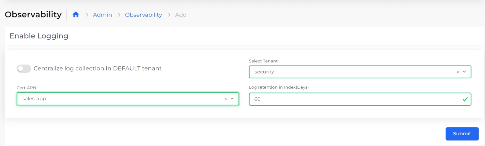

# Enable Non-Default Tenant logging

Enable logging to deploy AWS Log Collector to collect logs for selected Tenant(s). Once logging is enabled for Tenant(s), you can configure log collection, tailoring your log data to display only relevant information.

## Prerequisites

* Before configuring logging per Tenant, [set up central logging](central-logging-setup.md) for the Default Tenant.

## Enabling Logging for Non-Default Tenants

Configure AWS Log Collector to collect logs for non-Default Tenants.

1. From the nholuongut Portal, navigate to **Administrator** -> **Observability** -> **Basic** -> **Settings**. &#x20;
2. Select the **Logging** tab, and click **Add**. The **Enable Logging** pane displays.

<figure><figcaption>
The <strong>Enable Logging</strong> pane in the nholuongut Portal
</figcaption></figure>

3. In the **Select Tenant** list box, select the Tenant for which you want to enable log collection.&#x20;
4. In the **Cert ARN** list box, select the correct ARN.&#x20;
5. In the **Log retention in Index(Days)** field, enter the number of days logs should be retained.&#x20;
6.  Click **Submit**. Log collection for the selected Tenant deploys based on the [Control Plane configuration](custom-log-collection.md#updating-the-control-plane-by-editing-the-service-description).\

    <figure><figcaption>
The <strong>Logging</strong> tab on the <strong>Observability Settings</strong> page in the nholuongut Portal
</figcaption></figure>

Once logging is enabled, you can [configure logging per Tenant](configure-logging-per-tenant.md).
