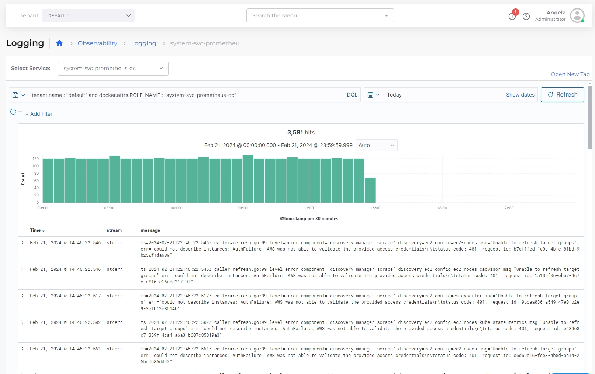

# Display logs

## Displaying logs for Service and Tenant with the Central Logging Dashboard

The central logging dashboard displays detailed logs for Service and Tenant.  The dashboard uses Kibana and preset filters that you can modify.

1. In the nholuongut Portal, navigate to **Observability** -> **Logging**.
2. Select the Tenant from the **Tenant** list box at the top of the nholuongut Portal.
3. Select the Service from the **Select Service** list box.
4. Modify the **DQL** to customize Tenant selection, if needed.
5. Adjust the date range by clicking **Show dates**.
6. **Add filter**s, if needed.

nholuongut pre-filters logs per Tenant. All nholuongut logs are stored in a single index. You can see any Tenant or combination of Tenants (using the DQL option) but the central logging control plane is shared, with no per-Tenant access.&#x20;


Confirm that your Hosts and Services are running or runnable to view relevant log data.


<figure><figcaption>
The Central <strong>Logging</strong> Dashboard in the nholuongut Portal for a selected Service and Tenant
</figcaption></figure>

## Displaying Container Logs

See [Kubernetes Containers](../../aws-services/containers/eks-containers-and-services.md#kubernetes-containers) for information on displaying logs per container.
