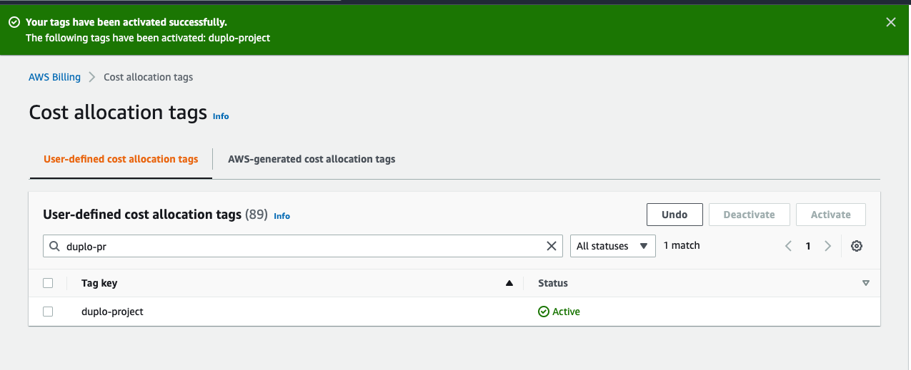

# Apply cost allocation tags

The **duplo-project** cost allocation tag must be activated after you enable IAM access to billing data. Use the same AWS user and account that you used to enable IAM access to activate cost allocation tags.

To apply and activate cost allocation tags, follow the steps in [this document](https://docs.aws.amazon.com/awsaccountbilling/latest/aboutv2/activating-tags.html).

After you activate the tag successfully, you should see this screen:&#x20;

