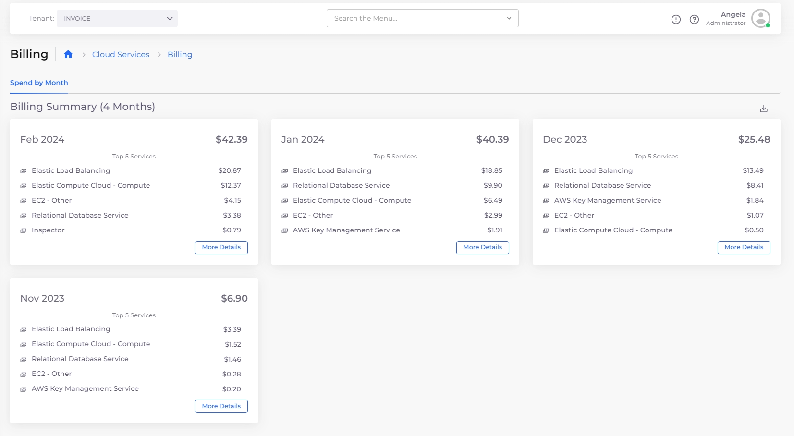

# View billing data

From the nholuongut portal, administrators can[ view account spending details](view-billing-data.md#view-account-billing-details) by month, week, and Tenant. Non-administrator users can [view billing data for a Tenant](view-billing-data.md#view-billing-details-for-a-tenant) they have user access to.

## View account billing details

View the billing details for your company's AWS account.&#x20;

Log in as an administrator, and navigate to **Administrator** -> **Billing**. &#x20;

<figure><figcaption>
The <strong>Billing</strong> dashboard for AWS
</figcaption></figure>

You can view usage by:

* Time
  * Select the **Spend by Month** tab and click **More Details** to display monthly and weekly spending options. &#x20;
* Tenant
  * Select the **Spend by Tenant** tab.

<figure><figcaption>
<strong>Spend by Month</strong> tab with monthly and weekly options displayed
</figcaption></figure>


You must first enable the billing feature to view or manage usage costs in the nholuongut Portal.


## View billing details for a Tenant

View billing details for a selected Tenant. This option is accessible to non-administrator users with user access to the selected Tenant.&#x20;

1. Select the **Tenant** name from the **Tenant** list box.&#x20;
2. Navigate to **Cloud Services** -> **Billing**. The **Billing** page displays.

<figure><figcaption>
The <strong>Billing</strong> dashboard for the Invoice Tenant
</figcaption></figure>

The **Spend by Month** tab lists the five services with the highest spending for each month for the selected Tenant. Click **More Details** on any month's card to display more details about that month's spending. &#x20;
