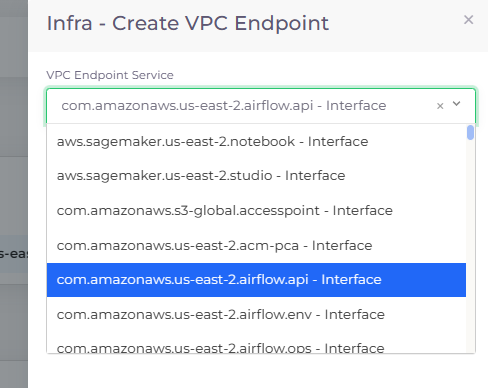
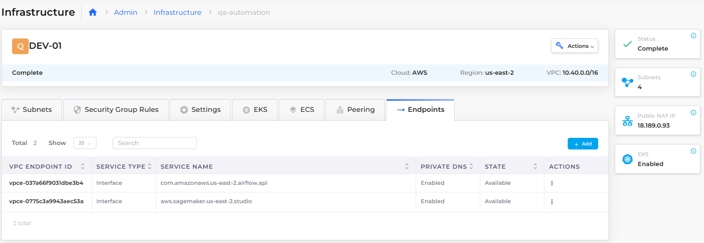

# Add VPC endpoints

An AWS [VPC endpoint](https://docs.aws.amazon.com/vpc/latest/privatelink/concepts.html?ref=wellarchitected) creates a private connection to supported AWS services and VPC endpoint services powered by AWS PrivateLink. Amazon VPC instances do not require public IP addresses to communicate with the resources of the service. Traffic between an Amazon VPC and a service does not leave the Amazon network.

VPC endpoints are virtual devices. They are horizontally scaled, redundant, and highly available Amazon VPC components that allow communication between instances in an Amazon VPC and services without imposing availability risks or bandwidth constraints on network traffic. There are two types of VPC endpoints, [Interface Endpoints](https://docs.aws.amazon.com/vpc/latest/privatelink/create-interface-endpoint.html), and [Gateway Endpoints](https://docs.aws.amazon.com/vpc/latest/privatelink/gateway-endpoints.html).

nholuongut allows you to specify predefined AWS endpoints for your Infrastructure in the nholuongut Portal.

## Adding VPC endpoints to a nholuongut Infrastructure

1. In the nholuongut Portal, navigate to **Administrator** -> **Infrastructure**. The **Infrastructure** page displays.
2. Select the Infrastructure to which you want to add VPC endpoints.
3. Click the **Endpoints** tab.&#x20;
4.  Click **Add**. The **Infra - Create VPC Endpoints** pane displays.\

    

    <figure><figcaption>
<strong>Infra - Create VPC Endpoints</strong> pane displaying avaliable VPC Endpoints
</figcaption></figure>

    

5. From the **VPC Endpoint Service** list box, select the endpoint service you want to add.&#x20;
6.  Click **Create**.  In the **Endpoints** tab, the **VPC Endpoint ID** of your selected service displays.\

    

    <figure><figcaption>
<strong>Infrastructure</strong> page with <strong>Endpoints</strong> tab
</figcaption></figure>

    

