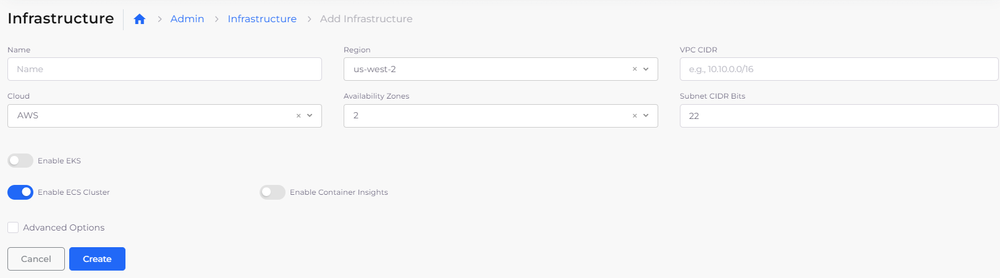

# ECS Setup

Setting up an Infrastructure that uses ECS is similar to creating an [Infrastructure that uses EKS](../kubernetes-cluster/), except that during creation, instead of selecting **Enable EKS**, you select **Enable ECS Cluster**.&#x20;

<figure><figcaption>
<strong>Add Infrastructure</strong> page with <strong>Enable ECS Cluster</strong> selected
</figcaption></figure>

For more information about ECS Services, see the [Containers and Services](../../../aws-services/containers/) documentation.


Up to one instance (0 or 1) of an ECS is supported for each nholuongut Infrastructure. &#x20;



Creating an Infrastructure with ECS can take some time. See the [Infrastructure ](../)section for details about other elements on the Add Infrastructure form.


