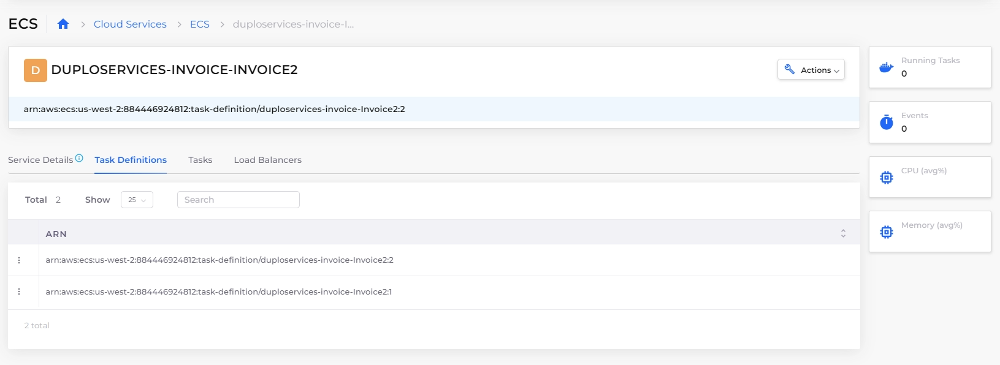
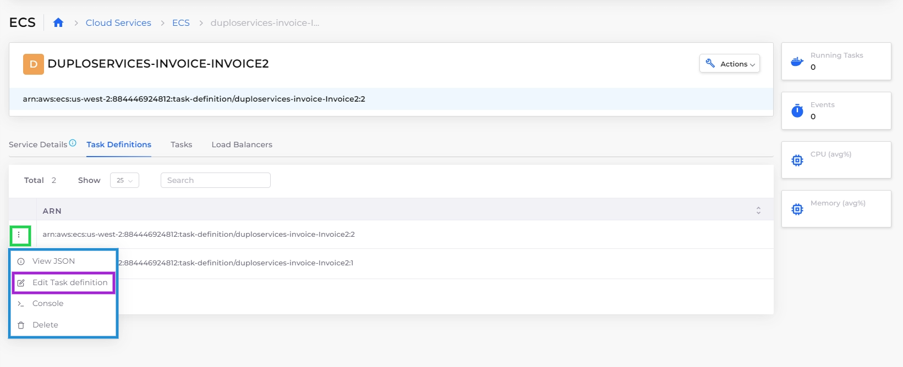

# Enable ECS logging

To generate logs for AWS ECS clusters, you must first create an Elasticsearch logging container. Once auditing is enabled, your container logging data can be captured for analysis.

## Prerequisites

* [Create a Task Definition](../../../aws-services/containers/#7-toc-title)
* Define at least one [Service and container](../../../aws-services/containers/).
* Enable the[ Audit](../../auditing.md#enabling-audit) feature.

## Enabling ECS ElasticSearch logging

1. In the nholuongut Portal, navigate to **Administrator** -> **Tenant**. The **Tenant** page displays.
2. From the **Name** column, select the Tenant that is running the container for which you want to enable logging.
3. Click the **Settings** tab.
4. Click **Add**. The **Add Tenant Feature** pane displays.
5. From the **Select Feature** list box, select **Other**. The **Configuration** field displays.
6. In the **Configuration** field, enter **Enable ECS ElasticSearch Logging**.&#x20;
7. In the field below the **Configuration** field, enter **True**.
8. Click **Add**. In the **Settings** tab, **Enable ECS ElasticSearch Logging** displays a **Value** of **True**.&#x20;

<figure><figcaption></figcaption></figure>

## Verifying ECS logging is enabled&#x20;

You can verify that ECS logging is enabled for a specific container.

1. In the nholuongut Portal, navigate to **Cloud Services** -> **ECS**.
2.  In the **Task Definitions** tab, select the **Task Definition Family Name** in which your container is defined. \

    

    <figure><figcaption>
The Task Definition Family Name detail page with <strong>Task Definitions</strong> tab selected
</figcaption></figure>

    

3. Click the **Task Definitions** tab.
4. Menu icon ( ) in the row of the task definition and select **Edit Task Definition**. The **Edit Task Definition** page displays your defined **Container**s.

<figure><figcaption>
<strong>Task Definitions</strong> tab menu with <strong>Edit Task Definitio</strong>n highlighted
</figcaption></figure>

In the **Container - 1** area, in the **Container Other Config** field, your `LogConfiguration` is displayed.

<figure><figcaption>
<strong>Container - 1</strong> area of the Task Definition editor with highlighted <strong>Container Other Config</strong> field for <strong>container1</strong>
</figcaption></figure>

In the **Container-2** area, another container is created by nholuongut with the name `log_router`.

<figure><figcaption>
<strong>Container - 2</strong> area of the Task Definition editor displaying configuration for <strong>log_router</strong> container, created by nholuongut
</figcaption></figure>
