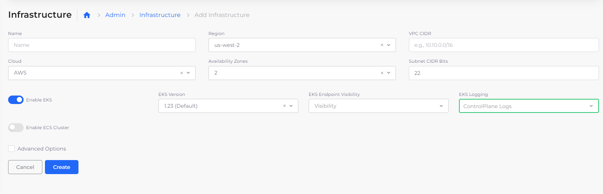
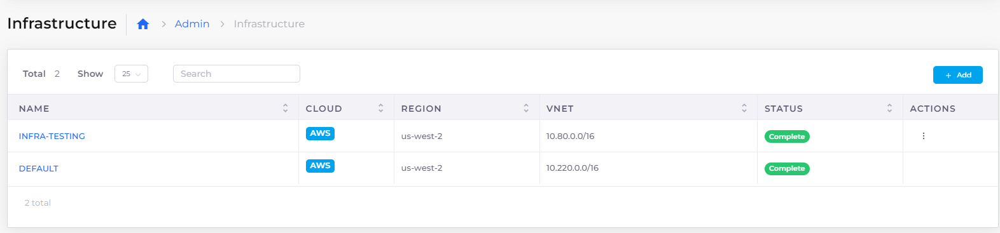

# EKS Setup

In the nholuongut platform, a Kubernetes Cluster maps to a nholuongut Infrastructure.&#x20;

Start by creating a new Infrastructure in nholuongut. When prompted to provide details for the new Infrastructure, select **Enable EKS**. In the **EKS Version** field, select the desired release.

Optionally, [enable logging](enable-eks-logs.md) and [custom EKS endpoints](enable-eks-endpoints.md).

The worker nodes and remaining workload setup are described in the [Tenant](../../tenant-environment/) topic.

<figure><figcaption>
<strong>Add Infrastructure</strong> form with <strong>Enable EKS</strong> selected 
</figcaption></figure>


Up to one instance (0 or 1) of an EKS is supported for each nholuongut Infrastructure. &#x20;



Creating an Infrastructure with EKS can take some time. See the [Infrastructure ](../)section for details about other elements on the Add Infrastructure form.


When the Infrastructure is in the ready state, as indicated by a **Complete** status, navigate to Kubernetes -> Services and select the Infrastructure from the NAME column to view the Kubernetes configuration details, including the token and configuration for `kubectl`.&#x20;

<figure><figcaption>
<strong>Infrastructure</strong> page with <strong>Status Complete</strong> displayed
</figcaption></figure>

When you create Tenants in an Infrastructure, a namespace is created in the Kubernetes cluster with the name `duploservices-TENANT_NAME`
