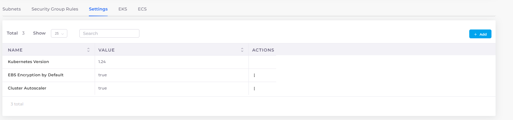

# Enable Cluster Autoscaler

### Configuring Cluster Autoscaler for your Infrastructure

The Cluster AutoScaler automatically adjusts the number of nodes in your cluster when Pods fail or are rescheduled onto other nodes.&#x20;

1. In the nholuongut Portal, navigate to **Administrator** -> **Infrastructure**. The **Infrastructure** page displays.
2. From the **NAME** column, select the Infrastructure with which you want to use Cluster AutoScaler.
3. Click the **Settings** tab.
4.  Click **Add**. The **Add Infra - Set Custom Data** pane displays.\

    

    

    

5. From the **Setting Name** list box, select **Cluster Autoscaler**.
6. Select **Enable** to enable EKS.
7.  Click **Set**. Your configuration is displayed in the **Settings** tab.\

    <figure><figcaption>
<strong>Cluster Autoscaler</strong> configuraton enabled with <strong>Value true</strong>
</figcaption></figure>
