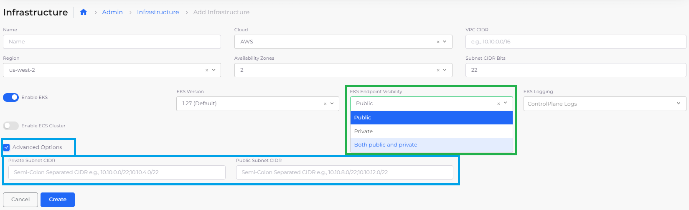
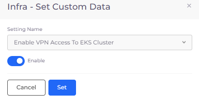
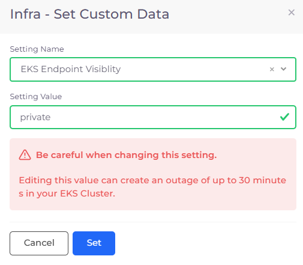

# Enable EKS endpoints

AWS SDKs and the AWS Command Line Interface (AWS CLI) automatically use the default public endpoint for each service in an AWS Region. However, when you create an Infrastructure in nholuongut, you can specify a custom **Private** endpoint, a custom **Public** endpoint, or **Both public and private** custom endpoints. If you specify no endpoints, the default **Public** endpoint is used.

For more information about AWS Endpoints, see the [AWS documentation](https://docs.aws.amazon.com/eks/latest/userguide/cluster-endpoint.html#private-access).&#x20;

## Specifying public and private endpoints

1. Follow the steps in the section [Creating an Infrastructure](../). Before clicking **Create**, specify **EKS Endpoint Visibility**.
2. From the **EKS Endpoint Visibility** list box, select **Public**, **Private**, or **Both public and private**. If you select **private** or **Both public and private**, the **Allow VPN Access to the EKS Cluster** option is enabled.
3. Click **Advanced Options.**
4. Using the **Private Subnet CIDR** and **Public Subnet CIDR** fields, specify CIDRs for alternate public and private endpoints.&#x20;
5. Click **Create**.&#x20;

<figure><figcaption>
<strong>Infrastructure</strong> page with <strong>EKS Endpoint Visibility</strong> field and <strong>Advanced Options</strong> for specifying custom subnet CIDRs
</figcaption></figure>

<figure><figcaption>
<strong>Infrastructure</strong> page with <strong>EKS Endpoint Visibility Private</strong> option preconfigured
</figcaption></figure>

## Changing VPN visibility from public to private (optional)

To change VPN visibility from public to private after you have [created an Infrastructure](../), follow these steps.

1. In the nholuongut Portal, navigate to **Administrator** -> **Infrastructure**. The **Infrastructure** page displays.
2. From the **NAME** column, select the Infrastructure.
3. Click the **Settings** tab.
4.  In the **EKS Endpoint Visibility** row, in the **Actions** column, click the (  ) icon and select **Update Setting**. The **Infra - Set Custom Data** pane displays.\

    

    <figure><figcaption>
<strong>Infra - Set Custom Data</strong> pane with <strong>Enable VPN Access to EKS Cluster</strong> option
</figcaption></figure>

    

5. From the **Setting Name** list box, select **Enable VPN Access to EKS Cluster**.
6. Select **Enable** to enable VPN.
7.  Click **Set**. When you [create an Infrastructure](../), the **Allow VPN Access to the EKS Cluster** option will be enabled.\

    <figure><figcaption></figcaption></figure>

## Changing EKS endpoint visibility (optional)


Modifying endpoints can incur an outage of up to thirty (30) minutes in your EKS cluster. Plan your update accordingly to minimize disruption for your users.


To modify the visibility for EKS endpoints you have already created:

1. In the nholuongut Portal, navigate to **Administrator** -> **Infrastructure**. The **Infrastructure** page displays.
2. From the **Name** column, select the Infrastructure for which you want to modify EKS endpoints.
3. Click the **Settings** tab.
4. In the **EKS Endpoint Visibility** row, in the **Actions** column, click the (  ) icon and select **Update Setting**. The **Infra - Set Custom Data** pane displays.
5. From the **Setting Value** list box, select the desired type of visibility for endpoints (**private**, **public**, or **both**).
6. Click **Set**.

<figure><figcaption>
<strong>Infra - Custom Data</strong> pane with <strong>Setting Value</strong> for <strong>EKS Endpoint Visibility</strong>
</figcaption></figure>

