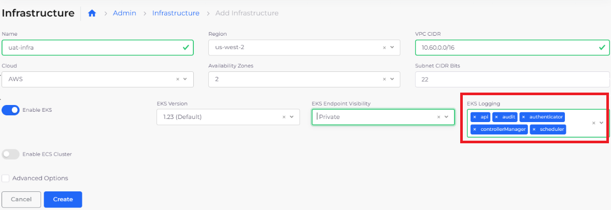
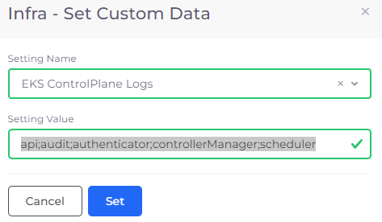
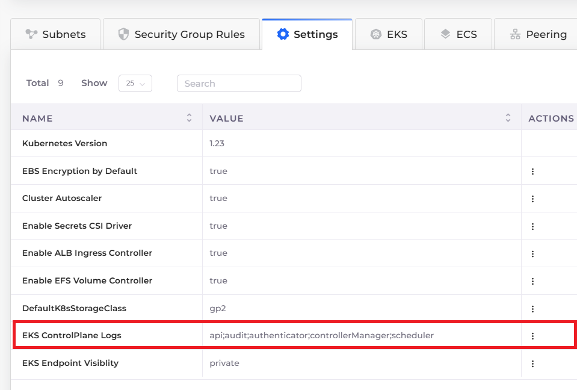

# Enable EKS logs

## Enabling EKS logging while creating an Infrastructure

Follow the steps in the section [Creating an Infrastructure](../). In the **EKS Logging** list box, select one or more **ControlPlane Log** types.

<figure><figcaption>
<strong>EKS Logging</strong> field with several <strong>ControlPLane Log</strong> types selected
</figcaption></figure>

## Enabling EKS logging for an existing Infrastructure

Enable EKS logging for an Infrastructure that you have already created.

1. In the nholuongut Portal, navigate to **Administrator** -> **Infrastructure**.
2. From the **NAME** column, select the Infrastructure for which you want to enable EKS logging.
3. Click the **Settings** tab.
4. Click **Add**. The **Infra - Set Custom Data** pane displays.
5. From the **Setting Name** list box, select **EKS ControlPlane Logs**.
6. In the **Setting Value** field, enter: `api;audit;authenticator;controllerManager;scheduler`
7. Click **Set**. The **EKS ControlPlane Logs** setting is displayed in the **Settings** tab.

<figure><figcaption>
<strong>Infra - Set Custom Data</strong> pane for setting <strong>EKS ControlPlane Logs</strong>
</figcaption></figure>

<figure><figcaption>
<strong>Settings</strong> tab with <strong>EKS ControlPlane Logs</strong> <strong>Value</strong> set
</figcaption></figure>

