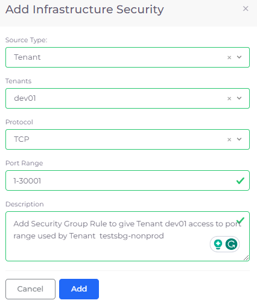
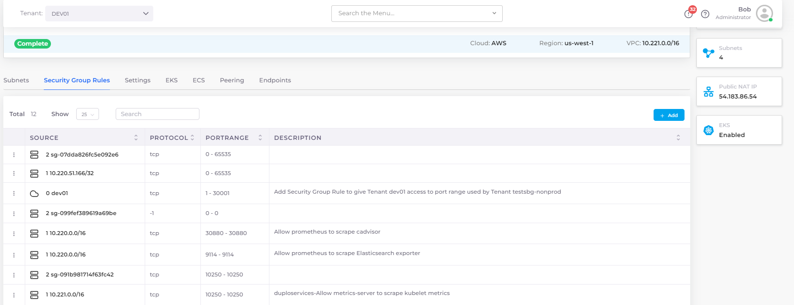

# Security Group rules

## Adding Security Group rules

1. &#x20;In the nholuongut Portal, navigate to **Administrator -> Infrastructure**. The **Infrastructure** page displays.
2. Select the Infrastructure for which you want to add or view Security Group rules from the **Name** column.
3. Click the **Security Group Rules** tab.
4.  Click **Add**. The **Add Infrastructure Security** pane displays.\

    

    <figure><figcaption>
<strong>Add Infrastructure Security</strong> pane defining port range for Cross-tenant access
</figcaption></figure>

    

5. From the **Source Type** list box, select **Tenant** or **IP Address**.
6. From the **Tenant** list box, select the Tenant for which you want to set up the Security Rule.
7. Select the protocol from the **Protocol** list box.
8. In the **Port Range** field, specify the range of ports for access (for example, **1-65535**).
9. Optionally, add a **Description** of the rule you are adding.
10. Click **Add**.

## Viewing Security Group rules

1. In the nholuongut Portal, navigate to **Administrator** -> **Infrastructure**.
2. Select the Infrastructure from the **Name** column.
3. Click the **Security Group Rules** tab. Security Rules are displayed.

<figure><figcaption>
Viewing Security Rules using the <strong>Security Group Rules</strong> tab
</figcaption></figure>

## Deleting Security Group rules

1. In the nholuongut Portal, navigate to **Administrator** -> **Infrastructure**.
2. Select the Infrastructure from the **Name** column.
3. Click the **Security Group Rules** tab. Security Rules are displayed in rows.
4. In the first column of the Security Group row, click the Options Menu Icon (  ) and select **Delete**.
