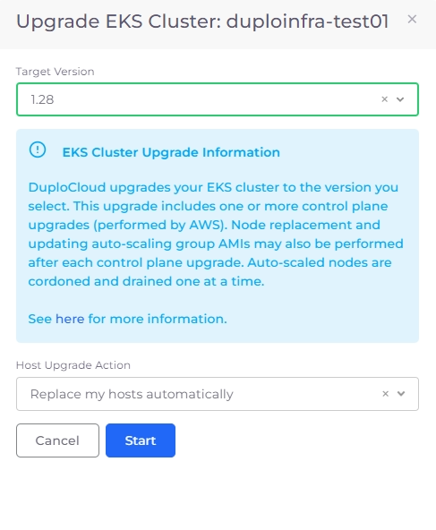
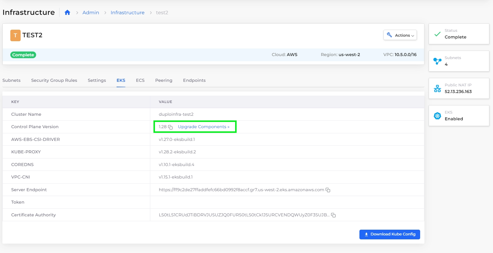
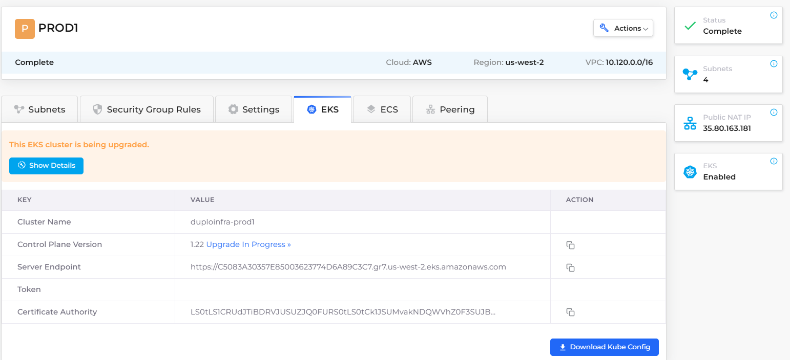
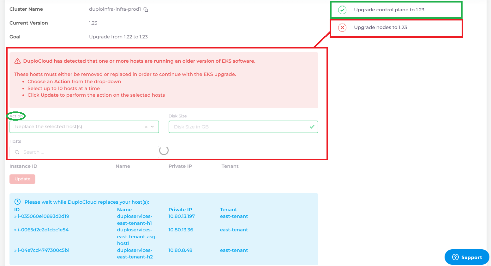
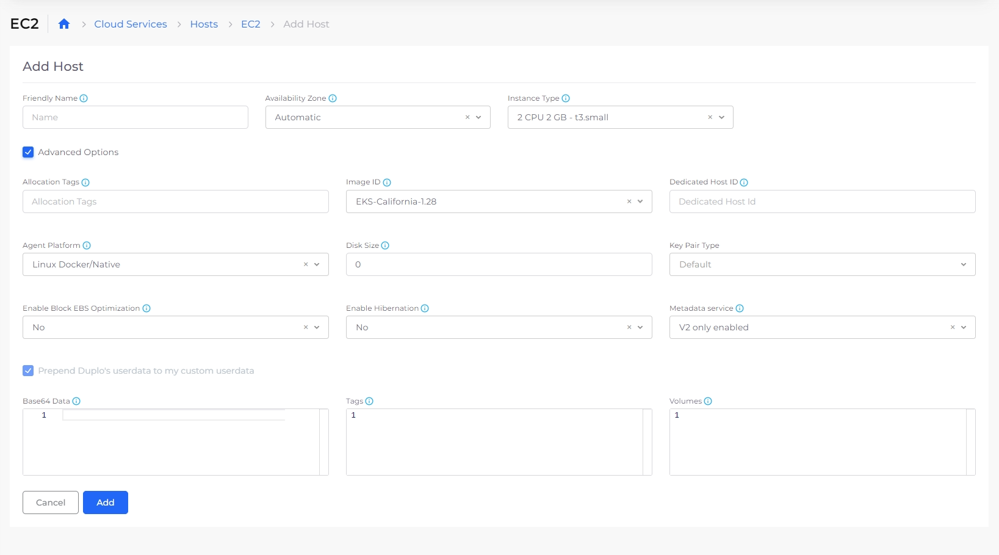

# Upgrading the EKS version

AWS frequently updates the EKS version based on new features that are available in the Kubernetes platform. nholuongut automates this upgrade in the nholuongut Portal.&#x20;


**IMPORTANT: An EKS version upgrade can cause downtime to your application depending on the number of replicas you have configured for your services. Schedule this upgrade outside of your business hours to minimize disruption.**


## About the upgrade process

nholuongut notifies users when an upgrade is planned. The upgrade process follows these steps:

1. A new EKS version is released.
2. nholuongut adds support for the new EKS version.
3. nholuongut tests all changes and new features thoroughly.
4. nholuongut rolls out support for the new EKS version in a platform release.
5. The user updates the EKS version.

Updating the EKS version:

* Updates the EKS Control Plane to the latest version.
* Updates all add-ons and components.
* Relaunches all Hosts to deploy the latest version on all nodes.

After the upgrade process completes successfully, you can assign allocation tags to Hosts.

## Starting the upgrade&#x20;

### Upgrading the EKS version

1. Click **Administrator** -> **Infrastructure.**
2. Select the Infrastructure that you want to upgrade to the latest EKS version.
3. Select the **EKS** tab. If an upgrade is available for the Infrastructure, an **Upgrade** link appears in the **Value** column.
4. Click the **Upgrade** link. The **Upgrade EKS Cluster** pane displays.

<figure><figcaption>
The <strong>Upgrade EKS Cluster</strong> pane
</figcaption></figure>

5. From the **Target Version** list box, select the version to which you want to upgrade.&#x20;
6. From the **Host Upgrade Action**, select the method by which you want to upgrade hosts.
7. Click **Start**. The upgrade process begins.

### Updating EKS Components (Add-ons)

1. Click **Administrator** -> **Infrastructure.**
2. Select the Infrastructure with components you want to upgrade.
3.  Select the **EKS** tab. If an upgrade is available for the Infrastructure components, an **Upgrade Components** link appears in the **Value** column.\

    <figure><figcaption>
EKS tab with component <strong>Upgrade</strong> available
</figcaption></figure>
4. Click the **Upgrade** link. The **Upgrade EKS Cluster** **Components** pane displays.

<figure><figcaption>
<strong>Upgrade EKS Cluster Components</strong> pane
</figcaption></figure>

5. From the **Host Upgrade Action**, select the method by which you want to upgrade hosts.
6. Click **Start**. The upgrade process begins.

## Monitoring upgrades&#x20;

The **EKS Upgrade Details** page displays that the upgrade is **In Progress**.

<figure><figcaption>
<strong>EKS Upgrade Details</strong> page displaying upgrade <strong>In Progress</strong>
</figcaption></figure>

Find more details about the upgrade by selecting your Infrastructure from the **Infrastructure** page. Click the **EKS** tab, and then click **Show Details**.&#x20;

<figure><figcaption>
<strong>Show Details</strong> button on the Infrastructure <strong>EKS</strong> tab with upgrade in progress
</figcaption></figure>

## Upgrade completion

When you click **Show Details**, the **EKS Upgrade Details** page displays the progress of updates for all versions and Hosts. Green checkmarks indicate successful completion in the **Status** list. Red **X**s indicate **Action**s you must take to complete the upgrade process.

<figure><figcaption>
<strong>EKS Upgrade Details</strong> window with <strong>Status</strong> list and <strong>Actions</strong> to be performed 
</figcaption></figure>

## Assign allocation tags

If any of your Hosts use allocation tags, you must assign allocation tags to the Hosts:

1. After your Hosts are online and available, navigate to **Cloud Services** -> **Hosts**.
2. Select the host group tab (**EC2**, **ASG**, etc.) on the **Hosts** screen.&#x20;
3. Click the **Add** button.
4. Name the Host and provide other configuration details on the **Add Host** form.
5. Select **Advanced Options**.
6. Edit the **Allocation Tag** field.&#x20;
7. Click **Create** and define your allocation tags.
8. Click **Add** to assign the allocation tags to the Host.

<figure><figcaption>
Allocation tags in the <strong>Add Host</strong> screen
</figcaption></figure>

For additional information about the EKS version upgrade process with nholuongut, see the [AWS FAQs section on EKS version upgrades](../../../aws-user-guide/aws-faq.md#eks-version-upgrade-faqs).                    &#x20;
