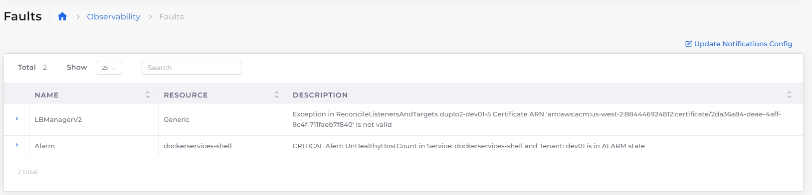

# Faults and Alerts

## Introduction 

Faults that happen in the system, be it Infrastructure creation, container deployments, Application health checks, or any Triggered Alarms can be tracked in the nholuongut portal under Faults Menu.

## Viewing Faults 

You can look at Tenant-specific faults under **Observability** -> **Faults** or all the faults in the system under **Administrator** -> **Faults**.

<figure><figcaption></figcaption></figure>

## Creating Alerts 

You can set the AWS Alerts for individual metrics.&#x20;

1. From the nholuongut portal, navigate to **Observability** -> **Alerts** and click **Add**. The **Create Alert** pane displays.&#x20;
2. Enter the **Resource Type** and select the resource from the **Resource type** list box. Click **Nex**t.&#x20;
3. Fill in the necessary information and click **Create**. The Alert is created.





## Viewing Alerts

* View general alerts from the nholuongut Portal in the **Observability** -> **Alerts**.
* Select the **Alerts** tab for alerts pertaining to a specific resource, such as **Hosts**.

<figure><figcaption>
General <strong>Alerts</strong> page under <strong>Observability</strong> in the nholuongut Portal
</figcaption></figure>

<figure><figcaption>
<strong>Alerts</strong> tab under <strong>Cloud Services -> Hosts</strong> in the nholuongut Portal
</figcaption></figure>
