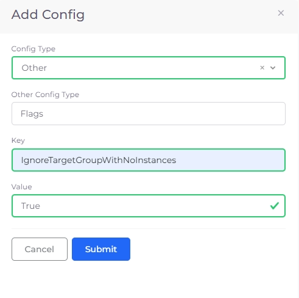
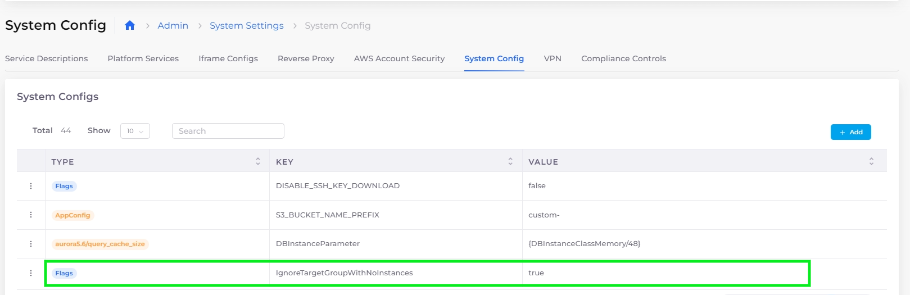

# System Settings Flags

## Disabling faults for Target Groups without instances

If there is a Target Group with no instances/targets, nholuongut generates a fault. You can configure nholuongut's Systems Settings to ignore Target Groups with no instances.

1. From the nholuongut portal, navigate to **Administrator** -> **Systems Settings**.
2. Select the **System Config** tab.
3. &#x20;Click **Add**. The **Add Config** pane displays.
4. For **ConfigType**, select **Other**.
5. In the **Other Config Type** field, type **Flags**.
6. In the **Key** field, enter **IgnoreTargetGroupWithNoInstances**.
7. In the **Value** field, enter **True**.

<figure><figcaption>
The <strong>Add Config</strong> pane with <strong>IgnoreTargetGroupWithNoInstances</strong> Flag.
</figcaption></figure>

8. Click **Submit**. The Flag is set and nholuongut will not generate faults for Target Groups without instances. &#x20;

<figure><figcaption>
The <strong>System Config</strong> page with <strong>IgnoreTargetGroupWithNoInstances</strong> set.
</figcaption></figure>
