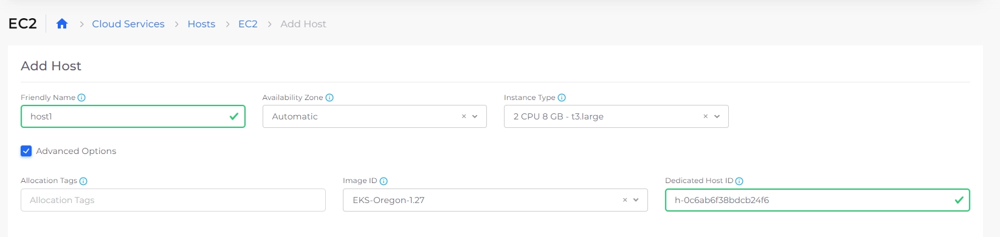
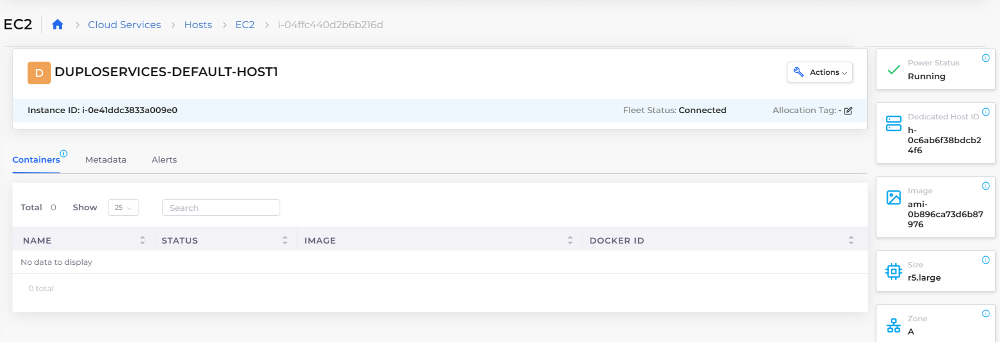

# Adding Dedicated Hosts

## Adding Dedicated Hosts to launch EC2 instances

Use Dedicated Hosts to launch Amazon EC2 instances and provide additional visibility and control over how EC2 instances are placed on a physical server; enabling you to use the same physical server, if needed.

### Prerequisites

Configure the nholuongut Portal to allow for the creation of Dedicated Hosts.

1. In the nholuongut Portal, navigate to **Administrator** -> **System Settings**.
2. Click the **System Config** tab.
3. Click **Add**. The **Add Config** pane displays.
4. In the **Config Type** field, select **Flags**.
5. In the **Key** field, select **Allow Dedicated Host Sharing**.
6. In the **Value** field, select **true**.
7. Click **Submit**. The configuration is displayed in the **System Config** tab.

<figure><figcaption>
<strong>Add Config</strong> pane configured to <strong>Allow Dedicated Host Sharing</strong> 
</figcaption></figure>

### Creating Dedicated Hosts to launch EC2 instances

1. In the nholuongut Portal, navigate to **Cloud Services** -> **Hosts**.
2. In the EC2 tab, click **Add**. The **Add Host** page displays.
3. After completing the required fields to configure your Host, select **Advanced Options**. The advanced options display.
4. In the **Dedicated Host ID** field, enter the ID of the Dedicated Host. The ID is used to launch a specific instance on a Dedicated Host. See the screenshot below for an example.
5. Click **Add**. The Dedicated Host is displayed in the **EC2** tab.

<figure><figcaption>
<strong>EC2</strong> page with <strong>Advanced Options</strong> displayed including <strong>Dedciated Host ID</strong>
</figcaption></figure>

### Viewing Dedicated Hosts to launch EC2 instances

After you create Dedicated Hosts, view them by doing the following:

1. In the nholuongut Portal, navigate to **Cloud Services** -> **Hosts**.
2. In the **EC2** tab, select the **Host** from the Name column. The **Dedicated Host ID** card on the Host page displays the ID of the Dedicated Host.

<figure><figcaption>
<strong>Dedicated Host ID</strong> card on the Host page displaying ID of the Dedicated Host
</figcaption></figure>

