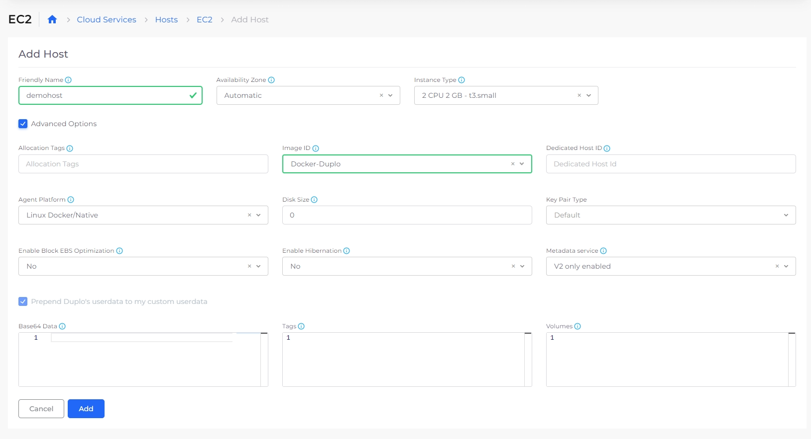

# Adding Hosts

nholuongut AWS supports **EC2**, **ASG**, and **BYOH** (Bring Your Own Host) types. Use **BYOH** for any VMs that are not **EC2** or **ASG**.

## Adding a Host (VM)

1. Ensure you have selected the appropriate Tenant from the **Tenant** list box at the top of the nholuongut Portal.
2. In the nholuongut Portal, navigate to **Cloud Services** -> **Hosts**.&#x20;
3. Click the tab that corresponds to the type of Host you want to create (**EC2**, **ASG**, or **BYOH**).
4. Click **Add**. The Host that you added is displayed in the appropriate tab (**EC2**, **ASG**, or **BYOH**).

To connect to the Host using SSH, [follow this procedure](ssh-ec2-instance.md).

<figure><figcaption><p><strong>Add Host</strong> page</p></figcaption></figure>


The EKS **Image ID** is the image published by AWS specifically for an EKS worker in the version of Kubernetes deployed at Infrastructure creation time.

If no **Image ID** is available with a prefix of **EKS**, copy the **AMI ID** for the desired EKS version by referring to this [AWS documentation](https://docs.aws.amazon.com/eks/latest/userguide/eks-optimized-amis.html). Select **Other** from the **Image ID** list box and paste the copied **AMI ID** in the **Other Image ID** field. Contact the nholuongut Support team via your Slack channel if you have questions or issues.


## Creating Kubernetes StorageClass and PVC constructs in the nholuongut Portal.

See [Kubernetes StorageClass and PVC](../../../kubernetes-overview/kubernetes-storageclass-and-pvc/).

## Supported Host Actions

1. From the nholuongut Portal, navigate to **Cloud Services** -> **Hosts**.&#x20;
2. Select the **Host** name from the list.
3. From the **Actions** list box, you can select **Connect**, **Host Settings**, or **Host State** to perform the following supported actions:&#x20;

### **Connect:**

<table data-header-hidden><thead><tr><th width="180"></th><th></th></tr></thead><tbody><tr><td><strong>SSH</strong></td><td>Establish an <a href="ssh-ec2-instance.md#connecting-to-an-ec2-linux-instance-using-ssh">SSH connection</a> to work directly in the AWS Console.</td></tr><tr><td><strong>Connection Details</strong></td><td>View connection details (connection type, address, user name, visibility) and <a href="ssh-ec2-instance.md#connect-by-downloading-a-key">download the key</a>.</td></tr><tr><td><strong>Host Details</strong></td><td>View Host details in the <strong>Host Details</strong> YAML screen.</td></tr></tbody></table>

<div align="left">

<figure><figcaption><p>The Host <strong>Actions</strong> menu with <strong>Connect</strong> selected.</p></figcaption></figure>

</div>

### **Host Settings:**

<table data-header-hidden><thead><tr><th width="208"></th><th></th></tr></thead><tbody><tr><td><strong>Create AMI</strong></td><td>Set the <a href="create-amazon-machine-image-ami.md">AMI</a>.</td></tr><tr><td><strong>Create Snapshot</strong></td><td>Create a <a href="backups.md">snapshot </a>of the Host at a specific point. </td></tr><tr><td><strong>Update User Data</strong></td><td>Update the Host user data.</td></tr><tr><td><strong>Change Instance Size</strong></td><td>Resize a Host instance to accommodate the workload. </td></tr><tr><td><strong>Update Auto Reboot Status Check</strong></td><td>Enable or disable <a href="configure-auto-reboot.md">Auto Reboot</a>. Set the number of minutes after the AWS Instance Status Check fails before automatically rebooting. </td></tr></tbody></table>

<div align="left">

<figure><figcaption><p>The Host <strong>Actions</strong> menu with <strong>Host Settings</strong> selected.</p></figcaption></figure>

</div>

### **Host State:**

<table data-header-hidden><thead><tr><th width="163"></th><th></th></tr></thead><tbody><tr><td><strong>Start</strong></td><td>Start the Host.</td></tr><tr><td><strong>Reboot</strong></td><td>Reboot the Host.</td></tr><tr><td><strong>Stop</strong> </td><td>Stop the Host. </td></tr><tr><td><strong>Hibernate</strong></td><td><a href="hibernate-an-ec2-host.md">Hibernate </a>(temporarily freeze) the Host.</td></tr><tr><td><strong>Terminate Host</strong></td><td>Terminate the Host. </td></tr></tbody></table>

<div align="left">

<figure><figcaption><p>The Host <strong>Actions</strong> menu with <strong>Host State</strong> selected.</p></figcaption></figure>

</div>

## Adding custom code for EC2 or ASG Hosts&#x20;

If you add custom code for EC2 or ASG Hosts using the **Base64 Data** field, your custom code overrides the code needed to start the EC2 or ASG Hosts and the Hosts cannot connect to EKS. Instead, [use this procedure](adding-hosts.md#adding-custom-code-for-ec2-and-asg-hosts-in-eks) to add custom code directly in EKS.&#x20;

```bash
#!/bin/bash
set -o xtrace
/etc/eks/bootstrap.sh duploinfra-MYINFRA --kubelet-extra-args '--node-labels=tenantname=duploservices-MYTENANT'

# Custom user code:
echo "hello world"
```

