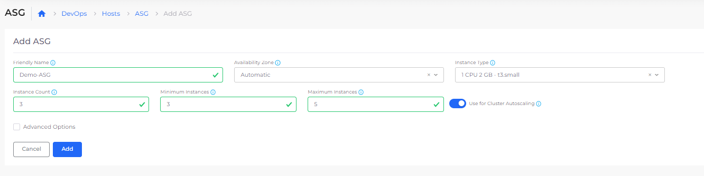
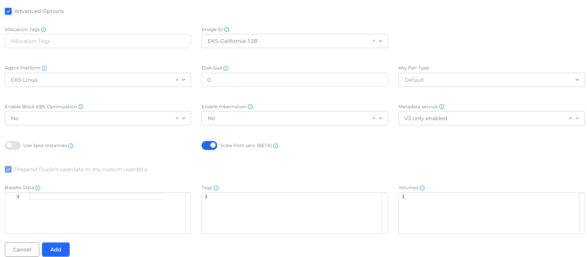
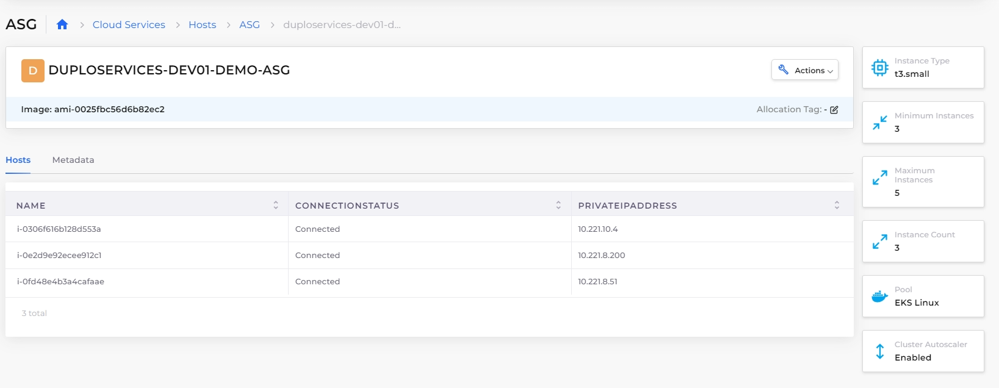

# Autoscaling Groups (ASG)

Configure Autoscaling Groups (ASG) to ensure the application load is scaled based on the number of EC2 instances configured. Autoscaling detects unhealthy instances and launches new EC2 instances. ASG is also cost-effective as EC2 Instances are dynamically created per the application requirement within minimum and maximum count limits.&#x20;

## Creating Autoscaling Groups (ASG)


The Use for Cluster Autoscaling option will not be available until you enable the [Cluster Autoscaler option in your Infrastructure](./#configuring-cluster-autoscaler-for-your-infrastructure).


1. In the nholuongut Portal, navigate to **Cloud Services** -> **Hosts**.
2. In the **ASG** tab, click **Add**. The **Add ASG** page is displayed.
3. In the **Friendly Name** field, enter the name of the ASG.
4. Select **Availability Zone** and **Instance Type**.
5. In the **Instance Count** field, enter the desired capacity for the Autoscaling group.
6. In the **Minimum Instances** field, enter the minimum number of instances. The Autoscaling group ensures that the total number of instances is always greater than or equal to the minimum number of instances.
7. In the **Maximum Instances** field, enter the maximum number of instances. The Autoscaling group ensures that the total number of instances is always less than or equal to the maximum number of instances.
8.  Select **Use for Cluster Autoscaling**.\

    <figure><figcaption>
<strong>Add ASG page</strong> with <strong>Use for Cluster Autoscaling</strong> enabled
</figcaption></figure>

9. Select **Advanced Options**.
10. Select the appropriate **Image ID**.&#x20;
11. From the Agent Platform list box, select **Linux Docker/Native** to run a Docker service or select **EKS Linux** to run services using EKS. Fill in additional fields as needed for your ASG.&#x20;
12. Optionally, enable [**Spot Instances**](spot-instances.md).&#x20;
13. Optionally, for EKS only, enable [**Scale from zero**](scale-to-or-from-zero.md).&#x20;
14. Click **Add**. Your ASG is added and displayed in the **ASG** tab.

<figure><figcaption>
ASG <strong>Advanced Options</strong> 
</figcaption></figure>

## Viewing Hosts in Autoscaling Groups

View the Hosts created as part of ASG creation from the ASG **Hosts** tab.

<figure><figcaption>
<strong>Hosts</strong> tab on the <strong>ASG</strong> page
</figcaption></figure>

## **Creating an Amazon EC2 Autoscaling Policy**

Refer to AWS [Documentation](https://docs.aws.amazon.com/autoscaling/ec2/userguide/as-scale-based-on-demand.html#as-how-scaling-policies-work) for detailed steps on creating Scaling policies for the Autoscaling Group.

## **Creating Services using Autoscaling Groups**

The nholuongut Portal provides the ability to configure Services based on the platforms **EKS Linux** and **Linux Docker/Native**.  Select the ASG based on the platform used when creating services and Autoscaling groups. Optionally, if you previously [enabled Spot Instances in the ASG](spot-instances.md#enabling-spot-instances-when-creating-autoscaling-groups), you can configure the Service to use Spot Instances by selecting **Tolerate spot instances**.&#x20;

.png>)

.png>)
