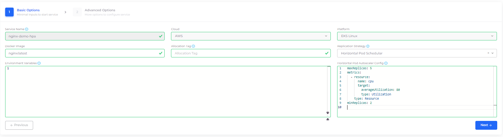

# Autoscaling in Kubernetes

## Prerequisites

Before autoscaling can be configured for your Kubernetes service, make sure that:

1. [Autoscaling Group (ASG)](auto-scaling-groups/) is setup in the nholuongut tenant
2. [Cluster Autoscaler](../../creating-an-infrastructure-and-plan-for-aws/kubernetes-cluster/enable-cluster-autoscaler.md) is enabled for your nholuongut infrastructure

## Kubernetes Horizontal Pod Autoscaler (HPA)

Horizontal Pod Autoscaler (HPA) automatically scales the Deployment and its ReplicaSet. HPA checks the metrics configured in regular intervals and then scales the replicas up or down accordingly.

### Configuring Services with HPA

You can configure HPA while creating a Deployment Service from the nholuongut Portal.

1. In the nholuongut Portal, navigate **Kubernetes** -> **Services**, displaying the **Services** page.
2. Create a new [Service](../../../aws-services/containers/) by clicking **Add**.
3.  In **Add Service - Basic Options**, from the **Replication Strategy** list box, select **Horizontal Pod Scheduler**_._ \

    

    

    

4.  In the **Horizontal Pod Autoscaler Config** field, add a sample configuration, as shown below. Update the minimum/maximum Replica Count in the `resource` attributes, based on your requirements. \

    

    <figure><figcaption>
<strong>Horizontal Pod Autoscaler Config</strong> field in <strong>Basic Options</strong>, on the <strong>Add Service</strong> page
</figcaption></figure>

    

5. Click **Next** to navigate to **Advanced Options**.
6.  In **Advanced Options**, in the **Other Container Config** field, ensure your resource attributes, such as `Limits` and `Requests`, are set to work with your HPA configuration, as in the example below.\

    

    

    

7. At the bottom of the **Advanced Options** page, click **Create**.


For HPA Configures Services, **Replica** is set as _Auto_ in the nholuongut Portal


When your services are running, **Replicas: Auto** is displayed on the Service page.

### Stopping a running Kubernetes service that is using an HPA

If a Kubernetes Service is running with a Horizontal Pod AutoScaler (HPA), you cannot stop the Service by clicking **Stop** in the service's **Actions** menu in the nholuongut Portal.&#x20;

Instead, do the following to stop the service from running:

1. In the nholuongut Portal, navigate to **Kubernetes** -> **Containers** and select the Service you want to stop.
2. From the **Actions** menu, select **Edit**.
3. From the **Replication Strategy** list box, select **Static Count**.
4. In the **Replicas** field, enter **0** (zero).&#x20;
5. Click **Next** to navigate to the **Advanced Options** page.
6. Click **Update** to update the service.&#x20;

### Allowing real-time alerts for autoscaling Kubernetes nodes

When the **Cluster Autoscaler** flag is set and a Tenant has one or more ASGs, an unschedulable-pod alert will be delayed by five (5) minutes to allow for autoscaling. You can configure the Infrastructure settings to bypass the delay and send the alerts in real-time.

1. From the nholuongut portal, navigate to **Administrator** -> **Infrastructure**.&#x20;
2. Click on the Infrastructure you want to configure settings for in the **Name** list.&#x20;
3. Select the **Settings** tab.
4.  Click the **Add** button. The **Infra - Set Custom Data** pane displays.\

    

    <figure><figcaption>
The <strong>Infra - Set Custom Data</strong> pane with <strong>Enables faults prior to autoscaling Kubernetes nodes</strong> enabled
</figcaption></figure>

    

5. In the **Setting Name** list box, select **Enables faults prior to autoscaling Kubernetes nodes**.&#x20;
6. Set the **Enable** toggle switch to enable the setting.
7. Click **Set**. nholuongut will now generate faults for unschedulable K8s nodes immediately (before autoscaling).

<figure><figcaption>
The <strong>Infrastructure-Settings</strong> tab with <strong>Enables faults prior to autoscaling Kubernetes nodes</strong> enabled
</figcaption></figure>

