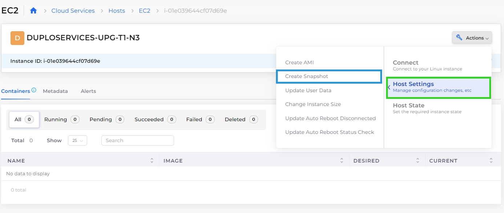
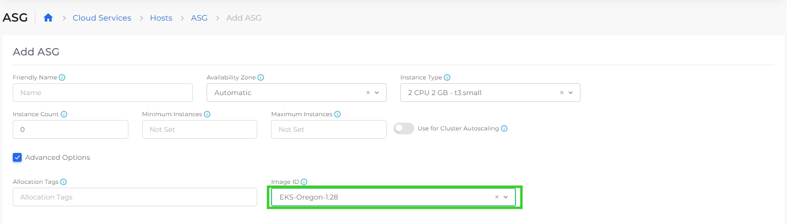

# Snapshots

Create Virtual Machine (VM) snapshots in the nholuongut Portal.

### Creating a Virtual Machine(VM) Host Snapshot

1. In the nholuongut Portal, navigate to **Cloud Services** -> **Hosts**. The **Hosts** page displays.
2. From the **Name** column, select the Host you want to backup.
3.  Click **Actions** and select **Snapshot**.\

    <figure><figcaption>
<strong>Actions -> Host Settings -> Create Snapshot</strong> option on <strong>Hosts</strong> page
</figcaption></figure>

### Using VM Snapshot as an Image for creating a new host

Once you take a VM Snapshot, the snapshot displays as an available **Image ID** when you [create a Host](./).

<figure><figcaption>
<strong>Image ID</strong> field under <strong>Advanced Options</strong> for Hosts <strong>Add ASG</strong> page 
</figcaption></figure>
