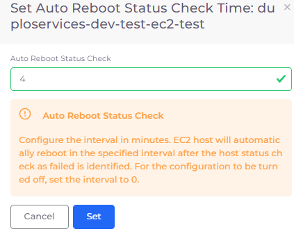
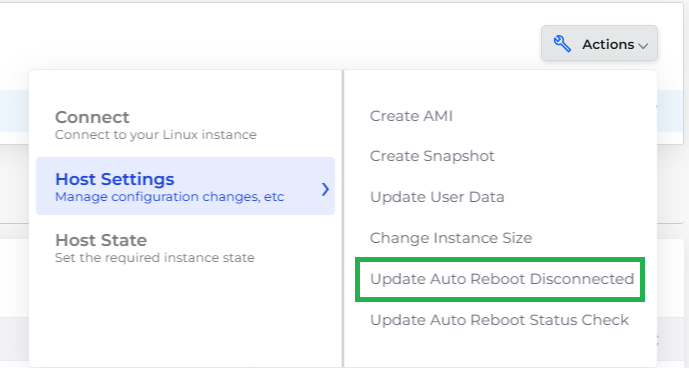
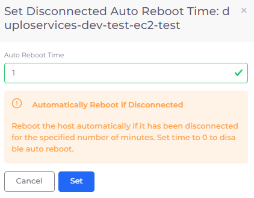

# Configure Auto-reboot

Configure hosts to be rebooted automatically if the following occurs:

* **EC2 Status Check** - Applicable for Docker Native and EKS Nodes. The Host is rebooted in the specified interval when a `StatusCheck` fault is identified.
* **Kubernetes (K8s) Nodes are disconnected:** Applicable for EKS Nodes only. The Host is rebooted in the specified interval when a `Host Disconnected` fault is identified.

You can configure host Auto Reboot features for a particular Tenant and for a Host.&#x20;


When you configure an Auto Reboot feature for both Tenant _and_ Host, the Host level configuration takes precedence over the configuration at the Tenant level.


## Configuring Auto Reboot per Tenant 

Use the following procedures to configure Auto Reboot at the Tenant level.

### Configuring Auto Reboot for EC2 Status Check per Tenant 

Configure the Auto Reboot feature at the Tenant for Docker Native and EKS Node-based Hosts, to reboot when a `StatusCheck` fault is identified.

1. In the nholuongut Portal, navigate to **Administrator** -> **Tenant**. The **Tenant** page displays.
2. Select a Tenant with access to the Host for which you want to configure Auto Reboot.
3. Click the **Settings** tab.
4.  Click **Add**. The **Add Tenant Feature** pane displays.\

    

    <figure><figcaption>
<strong>Add Tenant Feature</strong> pane with <strong>Enable Auto Reboot EC2 status check</strong> feature for a <strong>5-</strong>minute interval.
</figcaption></figure>

    

5. From the **Select Feature** list box, select **Enable Auto Reboot EC2 status check**.
6. In the field below the **Select Feature** list box, enter the time interval in minutes after which the host automatically reboots after a `StatusCheck` fault is identified. Enter zero (**0**) to disable this configuration.
7.  Click **Add**. The configuration is displayed in the **Settings** tab.\

    

    <figure><figcaption>
Tenant <strong>Settings</strong> tab displaying <strong>Enable Auto Reboot EC2 status check</strong> configuration <strong>Value</strong> of <strong>5</strong> minutes
</figcaption></figure>

    

#### Removing or Editing an Auto Reboot Tenant configuration

To remove or edit an Auto Reboot Tenant-level configuration, click the () icon and select **Edit Setting** or **Remove Setting**.

### Configuring Auto Reboot for Kubernetes (K8s) Node disconnection per Tenant 

Configure the Auto Reboot feature at the Tenant for EKS node-based Hosts, to reboot when a `Host Disconnected` fault is identified.

1. In the nholuongut Portal, navigate to **Administrator** -> **Tenant**. The **Tenant** page displays.
2. Select a Tenant with access to the Host for which you want to configure Auto Reboot.
3. Click the **Settings** tab.
4.  Click **Add**. The **Add Tenant Feature** pane displays.\

    

    <figure><figcaption>
<strong>Add Tenant Feature</strong> pane with <strong>Enable Auto Reboot K8s Nodes if disconnected</strong> feature for a <strong>3-minute</strong> interval 
</figcaption></figure>

    

5. From the **Select Feature** list box, select **Enable Auto Reboot K8s Nodes if disconnected**.
6. In the field below the **Select Feature** list box, enter the time interval in minutes after which the host automatically reboots when a `Host Disconnected` fault is identified. Enter zero (**0**) to disable this configuration.
7. Click **Add**. The configuration is displayed in the **Settings** tab.

<figure><figcaption>
Tenant <strong>Settings</strong> tab displaying <strong>Enable Auto Reboot K8s Nodes if disconnected</strong> configuration <strong>Value</strong> of <strong>3</strong> minutes
</figcaption></figure>

## Configuring Auto Reboot per Host 

Use the following procedures to configure Auto Reboot at the Host level.

### Configuring Auto Reboot for EC2 Status Check per Host 

Configure the Auto Reboot feature on the Host level for Docker Native and EKS Node-based Hosts, to reboot when a `StatusCheck` fault is identified.

1. In the nholuongut Portal, navigate to **Cloud Services** -> **Hosts**. The **Hosts** page displays.
2. Click the appropriate tab for your Host type and select the Host for which you want to configure Auto Reboot.
3.  Click the **Actions** menu and select **Host Settings** -> **Update Auto Reboot Status Check**. The **Set Auto Reboot Status Check Time** pane displays.​\

    

    <figure><figcaption>
Host <strong>Actions</strong> menu options <strong>Host Settings</strong> -> <strong>Update Auto Reboot Status Check</strong>
</figcaption></figure>

    

4.  In the **Auto Reboot Status Check** field, enter the time interval in minutes after which the host automatically reboots after a `StatusCheck` fault is identified. Enter zero (**0**) to disable this configuration.\

    

    <figure><figcaption>
<strong>Set Auto Reboot Status Check Time</strong> pane with <strong>Auto Reboot Status Check</strong> field
</figcaption></figure>

    

5. Click **Set**.

### Configuring Auto Reboot for Kubernetes Node disconnection per Host 

Configure the Auto Reboot feature on the Host level for EKS node-based Hosts, to reboot when a `Host Disconnected` fault is identified.

1. In the nholuongut Portal, navigate to **Cloud Services** -> **Hosts**. The **Hosts** page displays.
2. Click the appropriate tab for your Host type and select the Host for which you want to configure Auto Reboot.
3.  Click the **Actions** menu and select **Host Settings** -> **Update Auto Reboot Disconnected**. The **Set Auto Reboot Status Check Time** pane displays.​\

    

    <figure><figcaption>
Host <strong>Actions</strong> menu options <strong>Host Settings</strong> -> <strong>Update Auto Reboot Disconnected</strong>
</figcaption></figure>

    

4.  In the **Auto Reboot Time** field, enter the time interval in minutes after which the host automatically reboots when a `Host Disconnected` fault is identified. Enter zero (**0**) to disable this configuration.\

    

    <figure><figcaption>
<strong>Set Auto Reboot Status Check Time</strong> pane with <strong>Auto Reboot Time</strong> field
</figcaption></figure>

    

5. Click **Set**.

