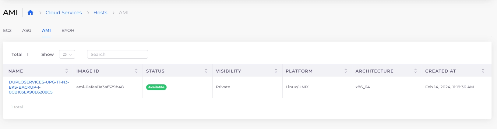
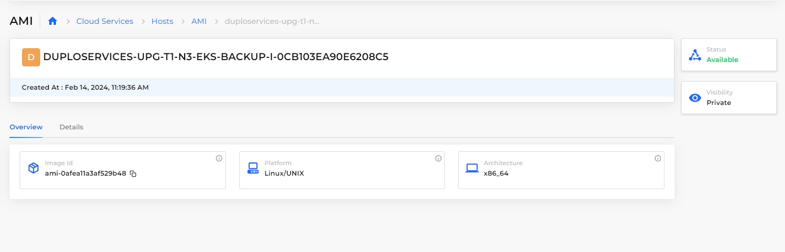
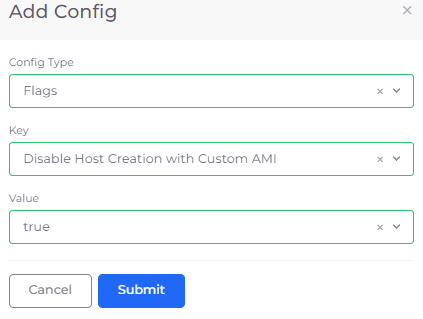

# Create Amazon Machine Image (AMI)

You can create [Amazon Machine Images (AMIs)](https://docs.aws.amazon.com/AWSEC2/latest/UserGuide/AMIs.html) in the nholuongut Portal. Unlike EC2 Hosts, which are fully dedicated physical servers for launching EC2 instances, AMIs are templates that contain the information required to launch an instance, such as an operating system, application software, and data. EC2 is used for creating a virtual server instance. AMI is the EC2 virtual machine image.

## Adding an AMI

1. In the nholuongut Portal, navigate to **Cloud Services** -> **Hosts**. The **Hosts** page displays.
2. Select the Host on which you want to base your AMI from the **Name** column.
3.  Click the **Actions** menu and select **Host Settings** -> **Create AMI**. The **Set AMI** pane displays. \

    

    <figure><figcaption>
<strong>Set AMI</strong> pane
</figcaption></figure>

    

4. In the **AMI Name** field, enter the name of the AMI.
5. Click **Create**.&#x20;

## Viewing an AMI

1. In the nholuongut Portal, navigate to **Cloud Services** -> **Hosts**. The **Hosts** page displays.
2. Select the **AMI** tab. Your AMIs are displayed on the **AMI** page. Selecting an AMI from this page displays the **Overview** and **Details** tabs for more information.

<figure><figcaption>
<strong>AMI</strong> page
</figcaption></figure>

<figure><figcaption>
<strong>Overview</strong> and <strong>Details</strong> tabs for an AMI
</figcaption></figure>

## Disabling Host creation for custom AMIs

You can disable host creation by non-administrators (Users) for custom AMIs by configuring the option in nholuongut. &#x20;

### Configuring the Disable Host Creation with Custom AMI option&#x20;

1. In the nholuongut Portal, navigate to **Administrator** -> **System Settings**.
2. Click the **System Config** tab.
3. Click **Add**. The **Add Config** pane displays.
4. In the **Config Type** list box, select **Flags**.
5. In the **Key** list box, select **Disable Host Creation with Custom AMI**.
6. In the **Value** list box, select **true**.
7. Click **Submit**.

<figure><figcaption>
<strong>Add Config</strong> pane with <strong>Disable Host Creation with Custom AMI</strong> selected
</figcaption></figure>

When this setting is configured, the **Other** option in the **Image ID** list box in the **Add Host** page, will be disabled, preventing hosts with custom AMIs from being created.

<figure><figcaption>
<strong>Add Host</strong> page with <strong>Other</strong> option in the <strong>Image ID</strong> list box disabled.
</figcaption></figure>
