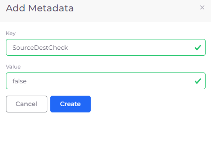
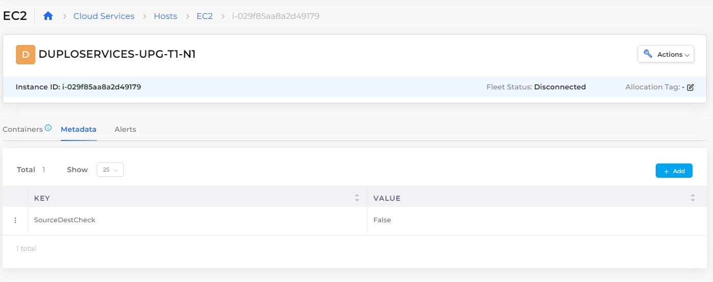

# Disable Source Destination Check

The AWS Cloudformation template contains a [Source Destination Check (`SourceDestCheck` parameter)](https://docs.aws.amazon.com/AWSCloudFormation/latest/UserGuide/aws-resource-ec2-networkinterface.html) that ensures that an EC2 Host instance is either the source or the destination of any traffic the instance receives. In the nholuongut Portal, this parameter is specified as `true`, by default, enabling source and destination checks.

There are times when you may want to override this default behavior, such as when an EC2 instance runs services such as network address translation, routing, or firewalls. To override the default behavior and set the `SourceDestCheck` parameter to `false`, use this procedure.

## Disable `SourceDestCheck` in the nholuongut Portal

Set AWS CloudFormation `SourceDestCheck` to `false` for an EC2 Host:

1. In the nholuongut Portal, navigate to **Cloud Services -> Hosts**.
2. In the **EC2** tab, select the Host for which you want to disable `SourceDestCheck`.
3. Click the **Metadata** tab.
4.  Click **Add**. The **Add Metadata** pane displays.\

    

    <figure><figcaption>
<strong>Add Metadata</strong> pane for <strong>Key SourceDestCheck</strong>
</figcaption></figure>

    

5. In the **Key** field, enter **SourceDestCheck**.
6. In the **Value** field, enter **False**.
7. Click **Create**. The **Key**/**Value** pair is displayed in the **Metadata** tab.

<figure><figcaption>
<strong>EC2 Host</strong> page <strong>Metadata</strong> tab displaying <strong>SourceDestCheck Value</strong> of <strong>False</strong>
</figcaption></figure>
