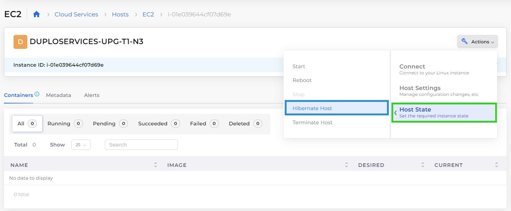

# Hibernate an EC2 Host

When you hibernate an instance, Amazon EC2 signals the operating system to perform hibernation (suspend-to-disk). Hibernation saves the contents from the instance memory (RAM) to your Amazon Elastic Block Store (Amazon EBS) root volume. Amazon EC2 persists the instance's EBS root volume and any attached EBS data volumes.

For more information on Hibernation, see the [AWS Documentation](https://docs.aws.amazon.com/AWSEC2/latest/UserGuide/Hibernate.html).

## Hibernating an EC2 Host

### Prerequisites

Before you can hibernate an EC2 Host in nholuongut, you must configure the EC2 host at launch to use the Hibernation feature in AWS.&#x20;

Follow the steps in the [AWS documentation](https://docs.aws.amazon.com/AWSEC2/latest/UserGuide/hibernating-instances.html) before attempting Hibernation of EC2 Host instances with nholuongut.

After you configure your EC2 hosts for Hibernation in AWS:

1. In the nholuongut Portal, navigate to **Cloud Services** -> **Hosts**.
2. In the **EC2** tab, select the Host you want to Hibernate.
3. Click the **Actions** menu, and select **Hibernate Host**. A confirmation message displays.

<figure><figcaption>
<strong>EC2</strong> page for a <strong>Host</strong>, displaying the <strong>Actions</strong> menu with <strong>Hibernate Host</strong> highlighted
</figcaption></figure>

4. Click **Confirm**. On the EC2 tab, the host's status displays as **hibernated**.
