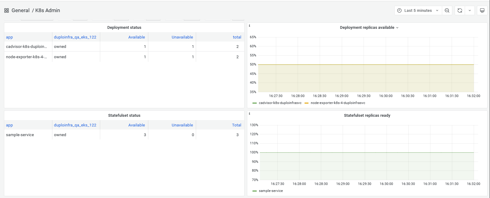

# Kubernetes Administrator dashboard

#### Monitoring Kubernetes StatefulSets&#x20;

Use the **K8s Admin** dashboard to monitor various statistics and statuses for Kubernetes, including the number and availability of StatefulSets defined for a service.

1. In the nholuongut Portal, select **Administrator** -> **Observability** -> **Metrics**.
2. Click the **k8s** tab. The **K8s Admin** dashboard displays.

<figure><figcaption>
<strong>K8s Admin</strong> Dashboard displaying StatefulSet status
</figcaption></figure>
