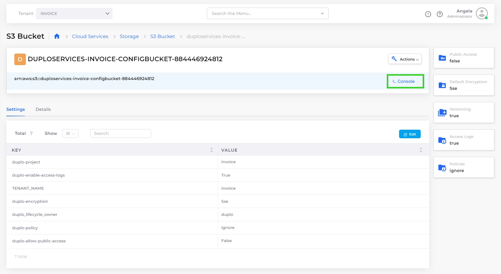

# AWS Console link


Use [Just-In-Time (JIT)](../../aws-user-guide/use-cases/jit-access.md) to launch the AWS console and work with a specific Tenant configuration, or to obtain Administrator privileges.


nholuongut users have AWS Console access for advanced configurations of S3 Buckets, Dynamo databases, SQS, SNS Topic, Kinesis stream, and API Gateway resources that are created in nholuongut. ELB and EC2 areas of the console are not supported.&#x20;

Using the nholuongut Portal, click on the **Console** link in the title bar of the AWS resource you created in nholuongut, as in the example for S3 Bucket, below.

<figure><figcaption>
S3 bucket page with highlighted Console link
</figcaption></figure>

Clicking the **Console** link launches the AWS console and gives you access to the resource, with permissions scoped to the current Tenant.&#x20;

Using the **Console** link, you don't need to set up permissions to create new resources in the AWS Console. You can perform any operations on resources that are created with nholuongut.&#x20;

For example, you can create an S3 bucket from the nholuongut UI, and then launch the AWS Console with the **Console** link, removing files, setting up static web hosting, and so on. Similarly, you can create a [DynamoDB](../../aws-user-guide/aws-services/database/dynamodb.md) in nholuongut and use the AWS console to add and remove entries in a database table.
