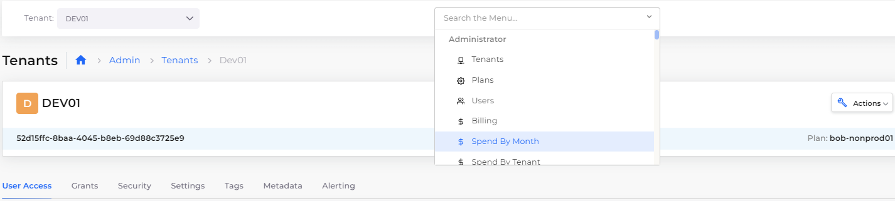

# Product Updates

## Q4 2024

* General
  * nholuongut's [Advanced Observability Suite (AOS)](diagnostics-overview/advanced-observability-suite.md) is available as an add-on service.

## Q3 2024

* Azure
  * [Set max number of Pods](overview-2/azure-services/agent-pool.md) for Azure Agent Pools.
  * Support for [Table, Queue, and Container storage types](overview-2/azure-services/storage-account.md#create-storage-account) within Azure Storage Accounts.
* GCP
  * Specify OS disk size when [creating a GCE VM](overview-1/use-cases/hosts-vms.md#gce-vm).
* Kubernetes
  * [Add Helm repositories and install Helm releases](kubernetes-overview/helm-charts.md) from the nholuongut UI.

## Q2 2024

* AWS
  * Support for [Amazon OpenSearch Service domain without EBS](overview/aws-services/elasticsearch.md#creating-an-opensearch-domain-without-ebs-storage) (Elastic Block Store).
  * Configure [admin-only access to the SSH key](overview/use-cases/hosts-vms/ssh-ec2-instance.md#configuring-admin-only-access-to-the-ssh-key).
  * Support for[ secondary indexes](aws-user-guide/aws-services/database/dynamodb.md#adding-dynamodb-database-tables) when using DynamoDB databases.
  * [Set a maximum RDS instance size ](overview/aws-services/database/rds-database/restrict-rds-instance-size.md)in Systems Settings.
  * [Support for editing in Apache Airflow](overview/aws-services/managed-airflow.md).
  * Set up [Billing Alerts](overview/use-cases/cost-management/configure-billing-alerts.md).
  * [Specify a Lambda architecture](overview/aws-services/lambda/#id-3-toc-title) when creating a Lambda function.
  * Support for[ Instance (Worker Nodes) or IP (Pod IPs) target types](kubernetes-overview/ingress-loadbalancer/adding-ingress.md#adding-ingress-redirect-config-and-annotations) when creating an EKS Ingress.&#x20;
* Azure
  * Support for [Azure VM Disk Controller](overview-2/use-cases/hosts-vms/).
  * Specify the cluster type, node VM size, and outbound connectivity source when [creating an AKS cluster](overview-2/use-cases/infrastructure-and-plan/aks-initial-setup.md#enabling-the-aks-kubernetes-cluster).
  * Support for [private DNS zones](overview-2/prerequisites/program-dns-entries.md).
  * Configure private endpoints for [MSSQL Server databases](overview-2/azure-services/databases/sql-database.md#creating-the-mssql-server).
  * Support for [Azure agent pools](overview-2/azure-services/agent-pool.md#adding-an-agent-pool) with availability zones.&#x20;
  * Configure [Redis databases](overview-2/azure-services/databases/redis-database.md#configure-public-network-access-for-databases-optional) with public network access.&#x20;
  * Support for [PostgreSQL Flexible Server](overview-2/azure-services/databases/postgresql-flexible-server.md) databases.
  * Support for [Azure Application Gateway SSL policies with AKS Ingress](kubernetes-overview/ingress-loadbalancer/aks-ingress/using-an-azure-application-gateway-ssl-policy-with-ingress.md) for ALB Load Balancers.
  * Support for [private endpoints ](overview-2/azure-services/storage-account.md#create-a-private-endpoint)with Azure Storage Account.
  * [Specify the AKS version and Network plugin](https://docs.nholuongut.com/docs/overview-2/use-cases/infrastructure-and-plan/aks-initial-setup) when enabling the AKS cluster.&#x20;
  * Specify the [node resource group](overview-2/use-cases/infrastructure-and-plan/aks-initial-setup.md) when configuring an AKS cluster.
  * [Specify a computer name](overview-2/use-cases/hosts-vms/#adding-a-host-vm) when creating a Host.&#x20;
* GCP
  * [Configure a friendly image name under Plan.](overview-1/use-cases/hosts-vms.md#configuring-a-friendly-image-name)
  * Select [single, or multi-region data location types](overview-1/gcp-services/s3-bucket-2.md#creating-a-gcp-cloud-storage-bucket) for GCP Storage buckets.&#x20;
  * Configure the [minimum number of ports per VM instance](overview-1/use-cases/hosts-vms.md#increasing-minimum-ports-per-vm-instance-gke-standard).
* Kubernetes
  * Integrate nholuongut-managed K8s clusters with [FluxCD](extras-overview/fluxcd.md).
  * Support for [migration from Flux v1 to Flux v2](extras-overview/fluxcd.md#migrating-from-flux-v1-to-flux-v2) for FluxCD users.&#x20;
  * Configure [read-only access to K8s Secrets](kubernetes-overview/configs-and-secrets/managing-secret-access-for-read-only-users-aws-and-gcp.md).
  * Create and manually run a [K8s Job](kubernetes/jobs.md) from a Kubernetes CronJob.
  * Configure faults for failed [Jobs](kubernetes/jobs.md#jobs-level-kubernetes-jobs-faults) and [CronJobs ](kubernetes/cronjobs.md)at the Tenant level.
  * Support for [DaemonSet](https://docs.nholuongut.com/docs/kubernetes-overview/daemonset#creating-a-daemonset-in-nholuongut-aws-or-gcp) with GCP or AWS.&#x20;
* General
  * Enhanced access to [nholuongut help options](welcome-to-nholuongut/nholuongut-support-model.md#how-to-get-help-from-within-the-nholuongut-portal) from the nholuongut Platform.&#x20;
  * [Skip faults for stopped Tenant instances.](diagnostics-overview/faults-and-alarms/#muting-faults-for-stopped-tenants)
  * [Configure user access to multiple Tenants](access-control/tenant-access/) with one step.
  * [Configure Okta](extras-overview/okta-identity-management.md) as a user source for the nholuongut Portal.
  * [Customize the text on the login button](extras-overview/login-banner-customization.md#adding-custom-login-banner-button-text) for custom banners.

## Q1 2024

* AWS
  * Conifgure [Automatic Failover for Redis](overview/aws-services/database/elastic-cache.md#creating-a-redis-elasticache-instance).
  * [Synch AWS Redis with Amazon CloudWatch Logs](overview/aws-services/database/elastic-cache.md#creating-a-redis-elasticache-instance) for automatic log delivery.
  * Configure [AWS JIT session timeout](aws-user-guide/use-cases/jit-access.md#configuring-admin-jit-timeout-via-aws-iam-role) using an IAM role.
  * [Enable automatic AWS ACM (SSL) Certificates](aws-user-guide/prerequisites/acm-certificate.md#enabling-automatic-aws-acm-certificate-creation) for a Plan.
  * [Configure K8s Ingress redirect ](kubernetes-overview/ingress-loadbalancer/adding-ingress.md#configure-ingress-with-redirect-config-and-annotations)using a container port name.
  * [Disable faults for Target Groups without instances.](overview/use-cases/faults-and-alarms/system-settings-flags.md#disabling-faults-for-target-groups-without-instances)
  * [Enable UltraWarm Data nodes ](overview/aws-services/elasticsearch.md)for OpenSearch domains.
  * Support for [upgrading EKS components](overview/use-cases/creating-an-infrastructure-and-plan-for-aws/upgrading-eks-version.md#updating-eks-components-add-ons) (add-ons).&#x20;
  * [Add a Web App Firewall URL](overview/aws-services/web-application-firewall-waf.md#creating-a-web-application-firewall-waf) when creating or updating a Plan.
  * [Update or skip a final RDS snapshot](aws-user-guide/aws-services/database/rds-database/backup-and-restore.md#updating-or-skipping-final-snapshot).
  * [Upgrade the EKS Cluster](overview/use-cases/creating-an-infrastructure-and-plan-for-aws/upgrading-eks-version.md).
  * Create an [OpenSearch](overview/aws-services/elasticsearch.md) domain. &#x20;
  * [Billing option is available per Tenant](overview/use-cases/cost-management/#view-billing-details-by-tenant).
  * [Scale to or from zero (0) using Auto-Scaling Groups](overview/use-cases/hosts-vms/auto-scaling/auto-scaling-groups/scale-to-or-from-zero.md).&#x20;
  * Create [Lambdas with Ephemeral Storage](overview/aws-services/lambda/#id-3-toc-title).
  * Support for [Lambda Dead Letter Queues](overview/aws-services/lambda/#id-3-toc-title).
  * [Set a delivery delay for SQS Queues](overview/aws-services/sqs-queue.md#creating-a-standard-queue), using increments of seconds.
  * Configure [Vanta compliance controls](overview/security-configuration-settings/vanta-compliance-controls.md) for nholuongut Tenants.
  * Support for [OpenSearch storage options](overview/aws-services/elasticsearch.md).
  * [Security Configurations Settings](overview/security-configuration-settings/) documentation section added.
  * ClusterIP and Worker Node target types are supported when creating [EKS Ingress](kubernetes-overview/ingress-loadbalancer/adding-ingress.md).
* GCP
  * Additional supported actions for [Cloud SQL databases](overview-1/gcp-services/s3-bucket-1.md#create-a-cloud-scheduler-job) (GCP Console, Edit, Delete, Stop, Restart, or Reset Password)
  * [GKE Standard mode](overview-1/use-cases/creating-an-infrastructure-and-plan-for-gcp/creating-gke-standard-service.md) is supported when creating nholuongut Infrastructures.
  * Support for [Firestore ](overview-1/gcp-services/gcp-databases/firestore-database.md)databases.
  * Support for [GCP Hosts](overview-1/use-cases/hosts-vms.md#id-3-toc-title) and [GCE VMs](overview-1/use-cases/hosts-vms.md#gce-vm).
  * Create [Node Pools](overview-1/gcp-services/node-pools.md) with support for accelerators and taints.
  * Support for [GKE Ingress.](kubernetes-overview/ingress-loadbalancer/gke-ingress.md)
* CI/CD
  * [Update a service with a stream-lined, read-to-use GitHub Actions script](introduction-to-ci-cd/github-actions/update-a-service.md).
* Kubernetes
  * [Enable real-time alerts for autoscaling Kubernetes nodes.](overview/use-cases/hosts-vms/auto-scaling/kubernetes-scaling-options.md#allowing-real-time-alerts-for-autoscaling-kubernetes-nodes)
  * Restrict open access to public Load Balancers for [AWS](overview/aws-services/load-balancers/#restricting-open-access-to-public-load-balancers),[ Azure](overview-2/azure-services/load-balancers.md#restricting-open-access-to-public-load-balancers), and [GCP](overview-1/gcp-services/step-4-create-a-load-balancer.md#restricting-open-access-to-public-load-balancers).&#x20;
* General&#x20;
  * Support for [NIST-800-171 compliance](security-and-compliance/access-control-4.md).
  * [Customize the nholuongut login screen banner.](extras-overview/login-banner-customization.md)
  * [Set Tenants to expire](overview/use-cases/tenant-environment/tenant-expiry.md) at specified dates and times.
  * Configure settings for all new Tenants under a Plan using [Tenant Config tab](overview/use-cases/tenant-environment/tenant-config-settings.md).
  * SIEM - [Configure agents to install on specific Tenants.](security-and-compliance/access-control-3/agent-management.md#agent-setup)

## Q4 2023

* AWS
  * Enable [Spot Instances](overview/use-cases/hosts-vms/auto-scaling/auto-scaling-groups/spot-instances.md) for EKS Autoscaling Groups (ASG).
  * Implement [Kubernetes Lifecycle Hooks](kubernetes-overview/kubernetes-lifecycle-hooks.md) while Adding a nholuongut EKS/Native Service.&#x20;
  * Enable [shared hosts](overview/use-cases/hosts-vms/adding-shared-hosts.md) to allow K8s Pods in a Tenant to run on Hosts in another Tenant.&#x20;
  * Set a [default automated backup retention period](aws-user-guide/aws-services/database/rds-database/backup-and-restore.md#id-0-toc-title-1) for RDS databases.
  * Enable bucket versioning when [creating an S3 bucket](overview/aws-services/s3-bucket.md#creating-an-s3-bucket).&#x20;
  * Create an [Amazon Machine Image (AMI)](overview/use-cases/hosts-vms/create-amazon-machine-image-ami.md).
  * Use [dedicated hosts](overview/use-cases/hosts-vms/adding-dedicated-hosts.md) to launch Amazon EC2 instances and provide additional visibility and control over how instances are placed on a physical server.
  * [Automatically reboot a host](overview/use-cases/hosts-vms/configure-auto-reboot.md) upon Status Check faults or Host disconnection.
  * Support for [SNS Topic Alerts](overview/use-cases/faults-and-alarms/sns-topic-alerts.md), enabling notifications and alerts across different AWS services and external endpoints.
  * [Establish VPN connections for private endpoints](overview/use-cases/creating-an-infrastructure-and-plan-for-aws/kubernetes-cluster/enable-eks-endpoints.md#enabling-vpn-for-private-visibility-optional) when creating an Infrastructure.
  * Restore an [RDS to a particular point in time](aws-user-guide/aws-services/database/rds-database/backup-and-restore.md#restoring-snapshots-to-a-point-in-time).
  * Dynamically [change the configuration of a Kafka Cluster](aws-user-guide/aws-services/kafka-cluster.md#changing-the-configuration-of-a-kafka-cluster).
  * Fields for Sort Key and Key Type are now available when [creating a DynamoDB](aws-user-guide/aws-services/database/dynamodb.md).
* Azure
  * Create a [MySQL Flexible Serve](overview-2/azure-services/databases/mysql-flexible-server.md)r managed database service.
  * Add an [Azure Service Bus](overview-2/azure-services/service-bus.md).
* Kubernetes
  * [Follow logs](overview/aws-services/containers/eks-containers-and-services.md#kubernetes-containers) for K8s containers in real-time.&#x20;
  * Influence Pod scheduling by specifying K8s YAML for [Pod Toleration](kubernetes-overview/pod-toleration.md).&#x20;
  * Create [Kubernetes Jobs (K8s Jobs)](kubernetes/jobs.md) in AWS and GCP  to manage short-lived, batch workloads in a Kubernetes cluster.
  * Create [Kubernetes CronJobs](kubernetes/cronjobs.md) in AWS and GCP to schedule long-term K8s Jobs to run at preset intervals.
*   General updates

    * The nholuongut UI contains numerous design, navigation, and usability improvements, including new menus for managing an RDS, Containers, and Hosts. These improvements are cross-platform and apply to AWS, Azure, and GCP.
    * Quickly search the nholuongut Portal for any navigation menus or tab labels, such as **Kubernetes Secrets** and **Spend by Month**, using the **Search** box at the top center of the nholuongut Portal.\

    
<figure><figcaption>
The <strong>Search</strong> box in the nholuongut Portal 
</figcaption></figure>

    * Refer to the [Supported Third-Party Tools](automation-and-tools/supported-third-party-tools.md) page for a list of out-of-the-box functionalities nholuongut supports.
    * nholuongut no longer supports launch configurations. Instead, launch templates are created. If you use launch configurations, nholuongut automatically converts them to launch templates with no interruption in uptime.&#x20;

## August 2023 and September 2023

* AWS
  * [Hibernate an EC2](overview/use-cases/hosts-vms/hibernate-an-ec2-host.md) host instance.
  * Display [Taints in ECS hosts on unreachable Nodes](overview/use-cases/hosts-vms/display-tainted-ec2-hosts.md).

## June 2023 and July 2023

* AWS
  * Manage [Tenant expiration and Tenant session durations](overview/use-cases/tenant-environment/tenant-session-duration.md).
  * Set a [monitoring interval for an RDS](overview/aws-services/database/rds-database/add-monitoring-interval.md) database.
  * [Enable or disable logging for an RDS ](overview/aws-services/database/rds-database/enable-or-disable-rds-logging.md)database.
  * Add [custom Lambda image configurations](overview/aws-services/lambda/create-lambda-using-container-image.md) and URLs.
  * Enable [Object Lock in S3 Buckets](overview/aws-services/s3-bucket.md#creating-an-s3-bucket) to prevent objects from being deleted or overwritten.&#x20;
  * Configure a [custom S3 Bucket for auditing](overview/use-cases/creating-an-infrastructure-and-plan-for-aws/ecs-setup/enable-ecs-logging.md#configuring-a-custom-s3-bucket-for-auditing-in-another-aws-account).
  * Update [Lifecycle Policies for EFS storage](aws-user-guide/aws-services/elastic-file-system-efs/#updating-efs-lifecycle-policies).
  * [Customize a Node Selector for EKS Services](overview/aws-services/containers/#adding-a-customized-node-selector-to-an-eks-service) to prevent overrides of specific configurations.
  * Access [ECS container task shells](overview/prerequisites/kubectl-shell.md#view-the-ecs-task-shell) directly from the nholuongut Portal.
  * Ability to designate [Essential Containers](overview/aws-services/containers/#7-toc-title-2) in Task definitions for ECS Services.
  * [Automate fault healing](overview/use-cases/faults-and-alarms/automatic-fault-healing.md) on EC2 Hosts that fail a status check.
  * Enhanced support for [Startup Probes](overview/aws-services/setting-up-probes.md).
* GCP
  * Support for [Redis database instances](overview-1/gcp-services/gcp-databases/managed-redis.md).
  * Support for [SQL databases](overview-1/gcp-services/gcp-databases/cloud-sql.md).
  * Change [Cloud Armour Security Policies](overview-1/gcp-services/cloud-armour.md#modifying-a-cloud-armour-configuration-security-policy).
* General updates
  * **Last Login** card available for determining the last user sign-in when [viewing user access](access-control/add-edit-or-delete-a-user.md#view-users).
  * [Grant access to specific databases](access-control/database-access-for-users.md) to non-administrators.

## May 2023

* AWS
  * [Enable EKS endpoints](overview/use-cases/creating-an-infrastructure-and-plan-for-aws/kubernetes-cluster/enable-eks-endpoints.md) in a nholuongut Infrastructure, in a more cost-effective and secure manner. Enabling endpoints in nholuongut allows your network communication to remain internal to the network, without using NAT gateways.&#x20;
  * [Multiple containers](overview/aws-services/containers/#7-toc-title) are now supported in the ECS **Task Definitions** tab.
  * [Start, stop, and restart ](overview/aws-services/containers/#7-toc-title-3)up to twenty (20) services at one time.
  * [Add VPC Endpoints](overview/use-cases/creating-an-infrastructure-and-plan-for-aws/add-vpc-endpoints.md) to a nholuongut Infrastructure to create a private connection to supported AWS services and VPC endpoint services powered by AWS PrivateLink.
  * [Enable logging for ECS containers](overview/use-cases/creating-an-infrastructure-and-plan-for-aws/ecs-setup/enable-ecs-logging.md).
  * Define [S3 bucket policies](overview/aws-services/s3-bucket.md#setting-s3-bucket-permissions-and-policies).
  * Support for [Lambda Layers](overview/aws-services/lambda/lambda-layers.md) has been added.
  * [CloudWatch EventBridge](aws-user-guide/aws-services/cloud-watch.md) rules and targets are supported.
  * The CloudFront feature and associated UI tab have been relocated in the nholuongut Portal from the **Cloud Services -> App Integration** menu item to the **Cloud Services -> Networking** menu item.
* Azure
  * Support for [Redis databases](overview-2/azure-services/databases/redis-database.md) is available.
* GCP
  * [Cloud Armour](overview-1/gcp-services/cloud-armour.md) is supported, to monitor your cloud infrastructures and deployed applications against cyber-attacks.

## April 2023

* AWS
  * Define [custom CIDRs](overview/aws-services/load-balancers/#adding-a-network-load-balancer-nlb-listener-with-a-custom-cidr) for NLB Load Balancers.
  * Manage multiple Load Balancer settings using the **Load Balancer** tab's [**Other Settings** card](overview/aws-services/load-balancers/#additional-load-balancer-settings). Settings include specifying a Web Application Firewall (WAF) Access Control List (ACL), enabling HTTP to HTTPS redirects, enabling Access Logs, setting an Idle Timeout, and an option to drop invalid headers.
  * Specify [custom public and private EKS endpoints](overview/use-cases/creating-an-infrastructure-and-plan-for-aws/kubernetes-cluster/enable-eks-endpoints.md) for your nholuongut Infrastructure during or after creating an Infrastructure.&#x20;
  * Gain [Cross-Tenant access to restricted policy-based resources](user-administration/access-control/tenant-access/cross-tenant-access.md#cross-tenant-access-to-restricted-policy-based-resources).
  * [JIT Access to the AWS Console is redesigned](aws-user-guide/use-cases/jit-access.md#obtaining-aws-access-for-a-workstation) with several usability enhancements.
  * [Enable Control Plane logging for EKS clusters](overview/use-cases/creating-an-infrastructure-and-plan-for-aws/kubernetes-cluster/enable-eks-logs.md).
  * Enable [Read-only processing for ECS services](overview/aws-services/containers/#enabling-read-only-processing-for-ecs-services).
  * Support for [Aurora RDS Serverless and MySQL read replicas](overview/aws-services/database/rds-database/add-an-rds-read-replica/add-aurora-rds-replicas.md) and ability to modify Serverless replica instance size.
  * Improved documentation for [upgrading an EKS cluster version](overview/use-cases/creating-an-infrastructure-and-plan-for-aws/upgrading-eks-version.md).
* Azure
  * [Add a direct link to the Azure Console ](overview-2/use-cases/azure-portal-link.md)from the nholuongut **Host** page.
* General Updates
  * [Set read-only access to specific Tenants](access-control/tenant-access/read-only-access-to-a-tenant.md) for nholuongut users.

## March 2023

* AWS
  * [Virtual Private Cloud (VPC) peering](overview/aws-services/virtual-private-cloud-vpc-peering.md) is supported to facilitate data transfer between VPCs.
  * [EMR Serverless](overview/aws-services/emr-serverless.md) is supported to run open-source big data analytics frameworks without configuring, managing, and scaling clusters or servers.
  * nholuongut users can obtain [Just-In-Time (JIT) access](aws-user-guide/use-cases/jit-access.md) to the AWS Console.
  * [AWS SQS Standard and FIFO queues](overview/aws-services/sqs-queue.md) are now supported.
  * Use the nholuongut Portal to work with AWS [Internet of Things (IoT)](overview/aws-services/iot-internet-of-things.md).
  * Support for Redis database versions when [creating Elastic Cache (Ecache)](overview/aws-services/database/elastic-cache.md).
  * Enable [shell access for ECS, Kubernetes, and Native docke](overview/prerequisites/kubectl-shell.md)r containers using a simplified workflow.
  * Reduce storage cost and increase performance by [setting GP3 as your default storage class](overview/aws-services/storage/gp3-storage-class.md).
  * Enable [NAT Gateways for High Availability (HA)](aws-user-guide/aws-services/nat-gateway-for-ha.md).
  * [Restart up to twenty nholuongut Services](overview/aws-services/containers/#7-toc-title-1) at once.
* GCP
  * Updated documentation for supported databases.
* CI/CD
  * Documentation for [Bitbucket Pipelines](introduction-to-ci-cd/bitbucket-pipelines/) is available, which allows developers to automatically build, test, and deploy their code every time they push changes to an Atlassian Bitbucket repository.&#x20;
* Terraform&#x20;
  * Added `IdleTimeout` to [`nholuongut_aws_load_balancer` resource](https://registry.terraform.io/providers/nholuongut/nholuongut/latest/docs/resources/aws_load_balancer).&#x20;

## February 2023

* AWS
  * Enable Elastic Kubernetes Service (EKS) for your existing infrastructure. EKS versions 1.22 and 1.23 are supported.
  * [Timestream databases](aws-user-guide/aws-services/database/timestream-database.md) are now supported.
* General updates
  * [Delete VPN connections](access-control/add-and-delete-vpn-access-for-users.md) for users.

## December 2022 and January 2023

* AWS
  * [AWS ElastiCache](overview/aws-services/database/elastic-cache.md), a managed caching service for Redis and Memcached, is now supported.&#x20;
  * Monitor Tenant usage in [Cost Management for billing](overview/use-cases/cost-management/) with weekly or monthly views. After clicking the **Spend by Tenant** tab, select the **shared** card to display tax and support costs.
  * Maintain cluster stability with [Ingress Health Checks annotations](kubernetes-overview/ingress-loadbalancer/adding-ingress.md#add-load-balancer-with-kubernetes-nodeport).&#x20;
  * Use the [K8s Admin dashboard to monitor StatefulSets](overview/use-cases/monitoring/kubernetes-administrator-dashboard.md).
  * [Force creation of StatefulSets](overview/aws-services/containers/#5-toc-title).
* Azure
  * Support for [Kubernetes Ingress](kubernetes-overview/ingress-loadbalancer/aks-ingress/).
  * Monitor Tenant usage in the [Cost Management for billing ](overview-2/use-cases/billing-and-cost-management/cost-management.md)feature with weekly or monthly views.
  * Edit [Azure agent pools](overview-2/azure-services/agent-pool.md#editing-an-agent-pool), used to run Azure Kubernetes (AKS) workloads.
* GCP
  * Monitor Tenant usage in the [Cost Management for billing](overview-1/use-cases/cost-management/) feature with weekly or monthly views.&#x20;
* Kubernetes (K8s)
  * Support for [Kubernetes Ingress in Azure](kubernetes-overview/ingress-loadbalancer/aks-ingress/).
  * Maintain cluster stability with [Ingress Health Checks annotations](kubernetes-overview/ingress-loadbalancer/adding-ingress.md#add-load-balancer-with-kubernetes-nodeport) for AWS.&#x20;
  * [Force creation of StatefulSets in AWS](overview/aws-services/containers/#5-toc-title).
  * Use the K8s Admin dashboard to [monitor StatefulSets in AWS](overview/use-cases/monitoring/kubernetes-administrator-dashboard.md).
  * Edit [Azure agent pools](overview-2/azure-services/agent-pool.md#editing-an-agent-pool), used to run Azure Kubernetes (AKS) workloads.

## November 2022

* [Ability to add Path-Based Routing rules](overview/aws-services/load-balancers/#2d32): Configure path-based routing rules for application load balancers.
* [Support for Aurora Serverless V2](aws-user-guide/aws-services/database/rds-database/#create-aurora-serverless-v2-cluster-database): User can create and manage Aurora Serverless V2 RDS.
* [Billing License Usage](overview/use-cases/cost-management/nholuongut-license-usage.md): Overview of nholuongut License Usage according to current service usage.

## October 2022

* [Ability to add Logging Infra at Tenant Level](overview/use-cases/central-logging/central-logging-setup.md#adding-logging-setup-at-tenant-level): Support to configure logging setup other than default tenant.
* [Support multiple docker registry credentials in a single tenant](overview/aws-services/containers/#add-multiple-docker-registry-credentials): The user can configure multiple docker registry credentials from the plan.

## September 2022

* [Support for Amazon Managed Apache Airflow](overview/aws-services/managed-airflow.md): Ability to configure AWS Managed Airflow
* [Configure custom prefix for S3](overview/aws-services/s3-bucket.md#add-custom-prefix-for-s3-buckets):  Ability to configure a prefix for S3 bucket names.
* [Azure Support to add Storage account](overview-2/azure-services/storage-account.md): Create Storage Accounts, File Shares, and generate Shared Access Signature (SAS).&#x20;
* Multiple [Azure User Enhancements](overview-2/azure-services/) were made.

## August 2022

* [Support for Elastic File System (EFS)](aws-user-guide/aws-services/elastic-file-system-efs/):  Support for adding EFS has been added to nholuongut. You can create and mount a shared filesystem for an Infrastructure in the nholuongut Portal.
* [Support for adding Kubernetes Storage Class:](overview/aws-services/storage/adding-k8s-storage-class.md) Support for Kubernetes Storage Class and Persistent Volumes is now available.
* [Support for Kubernetes Secret Provider Class](kubernetes-overview/configs-and-secrets/adding-secretproviderclass-custom-resource.md): This provides the ability to integrate AWS parameters and secrets to be available as Kubernetes secrets.
* [Ability to add Lambda using Container Images](overview/aws-services/lambda/create-lambda-using-container-image.md): Users can now configure an AWS Lambda using Container images.
* [Support to configure RDS Automatic Backup Retention](aws-user-guide/aws-services/database/rds-database/backup-and-restore.md#0-toc-title-1):  Administrators can configure RDS Automatic Backup Retention in days at the system level
* [Export Terraform from an existing Tenant](https://github.com/nholuongut/tenant-terraform-generator): Ability to export nholuongut terraform provider code for an existing nholuongut Tenant\

## July 2022

* [Ability to Automatically generate Alert](https://docs.nholuongut.com/docs/aws/use-cases/alerting-and-notifications/automatic-alert-creation):  Users can now configure automated alarm creation in AWS, to ensure new resources are included in monitoring.
* [Ability to set resource allocation quotas by an Admin](https://docs.nholuongut.com/docs/aws/use-cases/resource-quotas): Administrators would often like to restrict the type of resources that should or should not be provisioned in their environments. This feature allows them to configure those rules via a nholuongut Plan.
* [Support for Kubernetes Ingress Controller](https://docs.nholuongut.com/docs/aws/aws-services/containers): Support for the K8s Ingress controller has been added, this is a key piece of functionality for traffic routing to a K8s cluster.
* [RDS Snapshot Management](https://docs.nholuongut.com/docs/aws/aws-services/rds-database/manage-rds-snapshots):  Support for RDS database snapshots was added to the nholuongut Portal, accessible through the RDS page.
* [Terraform Provider updates](https://registry.terraform.io/providers/nholuongut/nholuongut/latest/docs): Expanded support for more resources in the nholuongut terraform provider, specifically for Microsoft Azure.&#x20;
