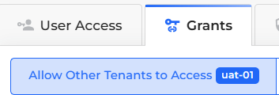
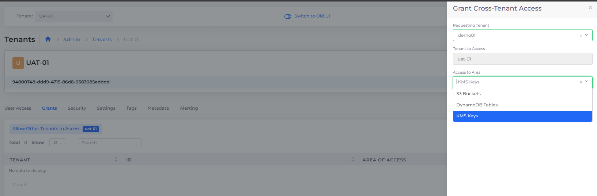

# Cross-tenant Access


These features are currently only available for AWS.


You can configure the nholuongut Portal to support various types of _Cross-tenant access_. Cross-tenant access enables you to share access to resources and services between two nholuongut [Tenants](../../../welcome-to-nholuongut/application-focussed-interface/nholuongut-common-components/tenant.md).

Configure Cross-tenant access to:

* [Grant a Tenant full access to another Tenant in the nholuongut Portal](cross-tenant-access.md#granting-full-cross-tenant-access-between-tenants).
* [Share specific services between Tenants in the nholuongut Portal](cross-tenant-access.md#granting-cross-tenant-access-to-specific-iam-restricted-services) that IAM policies restrict.

## Prerequisites

Before you can use Cross-tenant access, you must do the following:

* Add a [Security Group rule](../../../overview/use-cases/creating-an-infrastructure-and-plan-for-aws/security-group-rules.md) to allow port access between each of the Tenants requiring Cross-tenant access in the Security Group.
* Include the full application Namespace when accessing the domain in this format: **https://**_**NAMESPACE**_**.duploservices-**_**TENANT\_NAME**_**:**_**PORT**_

For example, If Tenant **dev01** is running an app named **myapp** on port **8080**, then access the domain using the URL `https://myapp.duploservices-dev01:8080`.&#x20;

## Granting general non-IAM restricted access between Tenants

When you grant general non-IAM restricted access between Tenants, you allow one nholuongut  Tenant full access to another Tenant's workspace or Namespace. Your Security Groups define restrictions in your underlying Cloud Platform. In the nholuongut Portal, you configure general access between Tenants using a Tenant's **Security** tab.

To grant Cross-tenant access only to specific services restricted by IAM policies, see [the next section](cross-tenant-access.md#granting-cross-tenant-access-to-specific-iam-restricted-services).

1. In the nholuongut Portal, navigate to **Administrator** -> **Tenants**.
2. Select the Tenant whose resources you want to share from the **Name** column.
3. Click the **Security** tab.
4. Click **Add**. The **Add Tenant Security** pane displays.
5. From the **Source Type** list box, select **Tenant**.
6. From the **Tenants** list box, select another Tenant with whom you want to share resources.
7. From the **Protocol** list box, select the protocol that you want to use for sharing.
8. In the **Port Range** field, specify the range of ports to which you want to grant access.
9. Add a user-friendly **Description** of this sharing rule.
10. Click **Add**.

<figure><figcaption>
<strong>Add Tenant Security</strong> pane
</figcaption></figure>

## Granting Cross-tenant access to specific IAM-restricted services

To allow access or create a share between two Tenants for specific IAM-restricted services, perform this procedure using the Tenant **Grants** tab.&#x20;

To establish general non-IAM restricted Cross-tenant access, see [the previous section](cross-tenant-access.md#granting-general-non-iam-restricted-access-between-tenants).&#x20;

You can share access to the following Services between Tenants:

* [S3 Buckets](../../../overview/aws-services/s3-bucket.md)
* [DynamoDB Tables](../../../aws-user-guide/aws-services/database/dynamodb.md)
* KMS Keys


Ensure that the two Tenants sharing resources reside within the same region in the AWS Portal.


1. In the nholuongut portal, navigate to **Administrator** -> **Tenants**. The **Tenants** page displays.
2. From the **Name** column, select the Tenant with access to the restricted resource that you want to share. In this example, we choose to share resources to which Tenant **uat-01** has access.
3.  Click the **Grants** tab. Select **Allow Other Tenants to access&#x20;**_**TENANT\_NAME**_, where _**TENANT\_NAME**_ is the Tenant you selected.\

    
<figure><figcaption>
<strong>Grants</strong> tab with <strong>Allow Other Tenants to access </strong><em><strong>TENANT_NAME</strong></em> option 
</figcaption></figure>

4.  Click **Add**. The **Grant Cross-Tenant Access** pane displays.\

    
<figure><figcaption>
<strong>Grant Cross-Tenant Access</strong> pane
</figcaption></figure>

5. From the **Requesting Tenant** list box, select the Tenant with whom you want to share access from the Requesting Tenant list box. In this example, the **Requesting Tenant** is **demo01**.
6. From the **Access to Area** list box, select the restricted policy-based resource you want to share.
7. Click **Create**. Your Cross-tenant Access share is created.

### Viewing Cross-tenant grants to restricted policy-based resources

1. In the nholuongut portal, navigate to **Admini**> **Tenants**. The **Tenants** page displays.
2. From the **Name** column, select the Tenant whose Cross-tenant grants you want to view. In this example, we select Tenant **uat-01**.
3. Click the **Grants** tab. Select **Allow Other Tenants to access&#x20;**_**TENANT\_NAME**_, where _**TENANT\_NAME**_ is the Tenant you selected.
4. The resources that _**TENANT\_NAME**_ (**uat-01**, in this example) can access are displayed.

<figure><figcaption>
<strong>Grant</strong> tab on the <strong>Tenant</strong> page
</figcaption></figure>

