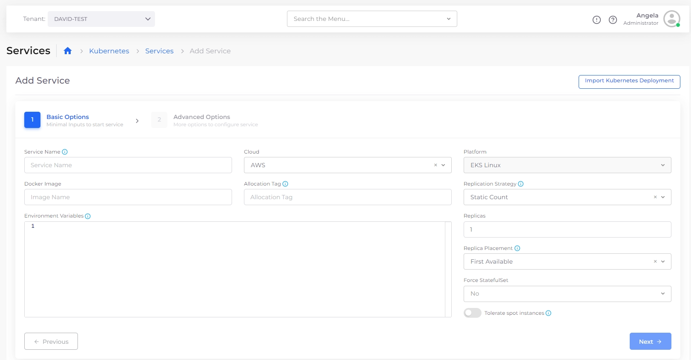
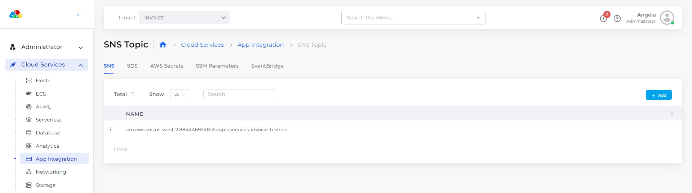

# Services

A Service could be a Kubernetes Deployment, StatefulSet, or DaemonSet. It can also be a Lambda function or an ECS task or service, capturing a microservice. Each service (except Lambda) is given a Load Balancer to expose itself and is assigned a DNS name.


nholuongut Services should not be confused with Kubernetes or ECS services. By Service, we mean application components that can be either Docker-based or serverless.


## nholuongut Supported Services

**For information on cloud-specific Services supported by nholuongut, see:**

* [AWS Services](../../../overview/aws-services/)
* [Azure Services](../../../overview-2/azure-services/)
* [GCP Services](../../../overview-1/gcp-services/)

nholuongut supports a simple, application-specific interface to configure dozens of cloud services, such as S3, SNS, SQS, Kafka, Elasticsearch, Data Pipeline, EMR, SageMaker, Azure Redis, Azure SQL, Google Redis, etc. Almost all commonly used services are supported, and new ones are constantly added. nholuongut Engineers fulfill most requests for new services within days, depending on their complexity.

All services and cloud features are created within a [Tenant](tenant.md). While users specify application-level constructs for provisioning cloud resources, nholuongut implicitly adds all the underlying DevOps and compliance controls.

Below is an image of some properties of a service:

<figure><figcaption>
The <strong>Add Service</strong> page in the nholuongut Platform
</figcaption></figure>





<figure><figcaption>
The <strong>SNS Topic</strong>, <strong>App Integration</strong> page in the nholuongut Portal
</figcaption></figure>




