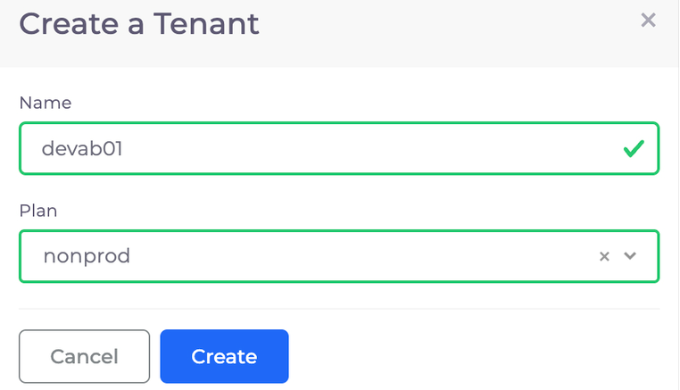
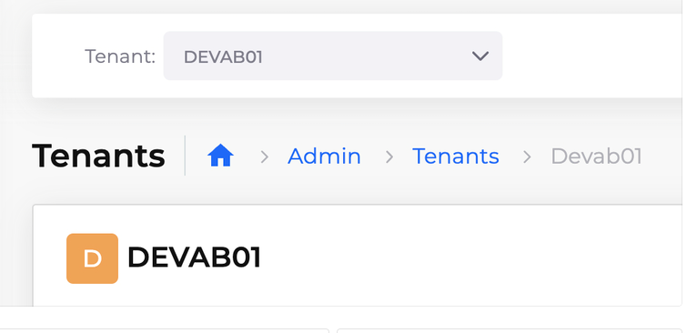

# 3. Create a nholuongut Tenant

To create a Tenant, navigate to **Administrator ->** **Tenants ->** **Add**. The **Create a Tenant** pane displays.

* Name: `dev`_\[YOUR\_INITIALS]_`01` (For example, `devab01`)
* Plan: `non-prod` (Specifying the Plan associates the new Tenant with the Infrastructure you created earlier)

Click **Create**.

<figure><figcaption>
<strong>Create a Tenant</strong> pane
</figcaption></figure>

This may take around 2 minutes. You may see a generated fault in **Administrator -> Faults** or the exclamation (**!**) icon displayed in the top right during provisioning.

Once it’s ready, select your new Tenant using the **Tenant** drop-down list box at the top of the screen.

<figure><figcaption>
<strong>Tenant</strong> drop-down list box
</figcaption></figure>
