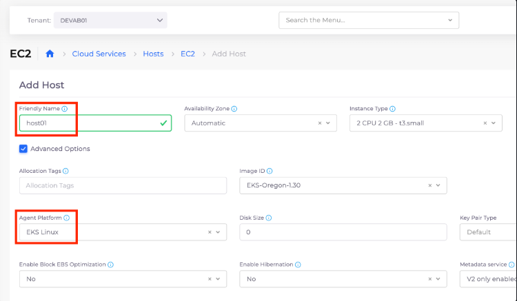

# 4. Create an EKS Worker Node

To create an EKS Worker Node, navigate to **Cloud Services -> Hosts -> Add**. The **Add Host** page displays.

**Friendly Name**: `host01`&#x20;


If you select **Advanced Options**, you will see that this new node defaults to being added to `EKS Linux` (**Agent Platform**) as a Worker Node.


<figure><figcaption>
<strong>Add Host</strong> page
</figcaption></figure>

After clicking **Add**, wait until the **Status** displays `Running` and **Fleet** displays `Connected`.
