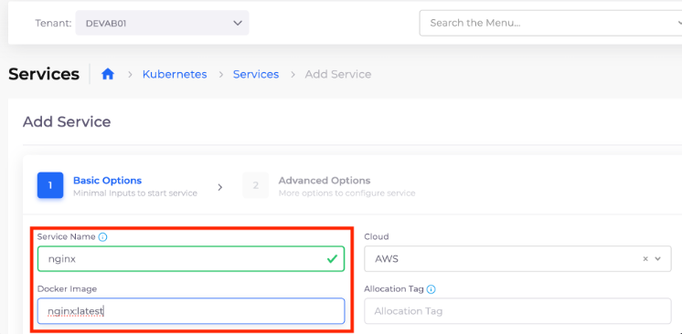

# 5. Deploy an Application

Navigate to **Kubernetes -> Services -> Add Service**. The **Add Service** page displays.

* **Name**: `nginx`&#x20;
* **Docker image**: `nginx:latest` (this is a sample public image)

<figure><figcaption>
<strong>Add Service</strong> page
</figcaption></figure>

Click **Next,** and then click **Create**.
