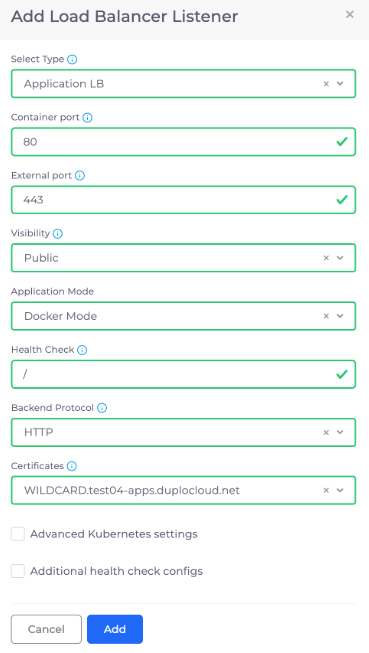
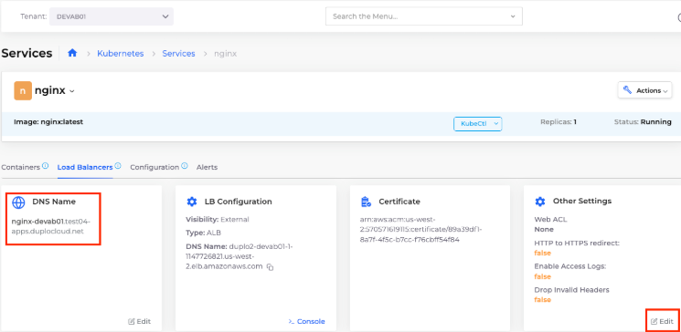

# 6. Create a Load Balancer

Navigate to **Kubernetes ->** **Services** and select the `nginx`Service from the list.&#x20;

Click **Load Balancers** **->** **Configure Load Balancer**. The **Add Load Balancer Listener** pane displays.

* **Type**: `Application LB`&#x20;
* **Container port**: `80`&#x20;
* **External port**: `443`&#x20;
* **Visibility**: `Public`&#x20;
* **Application mode**: `Docker Mode`&#x20;
* **Health check**: `/`&#x20;
* **Backend protocol**: `HTTP`&#x20;
* **Certificates**: `WILDCARD.test04-apps.nholuongut.net`

<figure><figcaption>
<strong>Add Load Balancer Listener</strong> pane
</figcaption></figure>

Click **Add** and wait until the Service is `Running` and the Load Balancer displays a status of `Ready`.

## Enable HTTP to HTTPs Redirect

Navigate to **Kubernetes -**> **Services** and select the `nginx`Service.

**Click Load Balancers.** On the **Other Settings** card, click **Edit.** Enable the **HTTP to HTTPS redirect** option.

<figure><figcaption>
The <strong>DNS Name</strong> and <strong>Other Settings</strong> cards in the <strong>Load Balancers</strong> tab
</figcaption></figure>

You can find the created **DNS Name** displayed on this page, CNAME'd to your Load Balancer name. Copy and paste the URL in the **DNS Name** card into your browser address to verify your application is available with a **Status** of `Running`. It may take a few minutes for the application to start.
