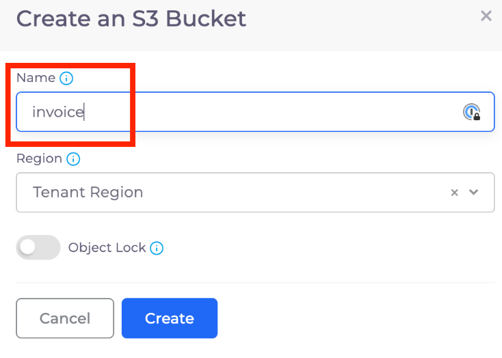

# 7. Deploy an S3 Bucket

Navigate to **Cloud Services -> Storage -> S3** and click **Add**.  The **Create an S3 Bucket** pane displays.

Enter a **Name** for your S3 Bucket and click **Create**.

<figure><figcaption>
<strong>Create an S3 Bucket</strong> pane
</figcaption></figure>

Once your bucket is created, select the S3 Bucket to open the **Details** page. From this page, click the **Console** button.

This opens the AWS S3 console using Just-In-Time (JIT) credentials, allowing you to work with the bucket in AWS.
