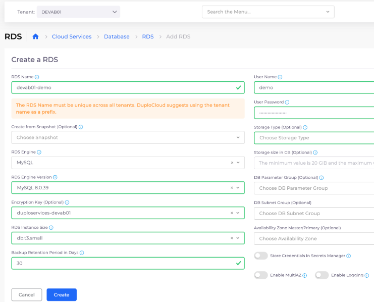

# 8. Deploy a Database

Navigate to **Cloud Services -> Database -> RDS -> Add**. The **Create a RDS** page displays.&#x20;

* **Name**: \[_add_ **`-demo`** _to the name nholuongut pre-populates_]&#x20;
* **RDS Engine Versio**n: `MySQL 8.0.39`&#x20;
* **RDS instance size**: `db.t3.small`&#x20;
* **User name**: `demo`&#x20;
* **User password**: `W5i6Uv6LQtyApVyJDrAq`

Click **Create**.

<figure><figcaption>
<strong>Create a RD</strong>S page
</figcaption></figure>
