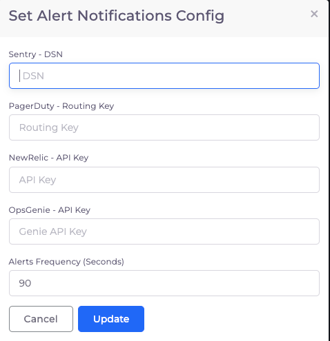

# 9. Create an Alarm

## Creating the Alert

Navigate to **Observability -> Alerts -> Add**. The **Create Alert** pane displays.

* **Resource Type**: `EC2`&#x20;
* **Resource**: \[_select a previously created_ [_EC2 instance_](4.-create-an-eks-worker-node.md)]&#x20;


In the example below, the Friendly Name in the **Resource** field is `host02`.


Click **Next** to proceed with defining metrics data.

<figure><figcaption>
<strong>Create Alert</strong> pane
</figcaption></figure>

## Defining metrics data

After clicking **Next**, continue defining the metrics data:

* **Metric Name**: `CPUUtilization`&#x20;
* **Statistic**: `Average`&#x20;
* **Operator**: `>=`&#x20;
* **Threshold**: `75`&#x20;
* **Period**: `5 Minutes`&#x20;
* **Severity**: `Critical`

Click **Create**.

<figure><figcaption>
<strong>Create Alert</strong> page for Metrics data
</figcaption></figure>

## Set the Alarm with a Third-Party Integration

Navigate to **Observability -> Faults -> Update Notifications Config**. The **Set Alert Notifications** **Config** pane displays.&#x20;

If instructed, enter additional data and click **Update** to set the alarm.

<figure><figcaption>
<strong>Set Alert Notifications</strong> <strong>Config</strong> pane
</figcaption></figure>
